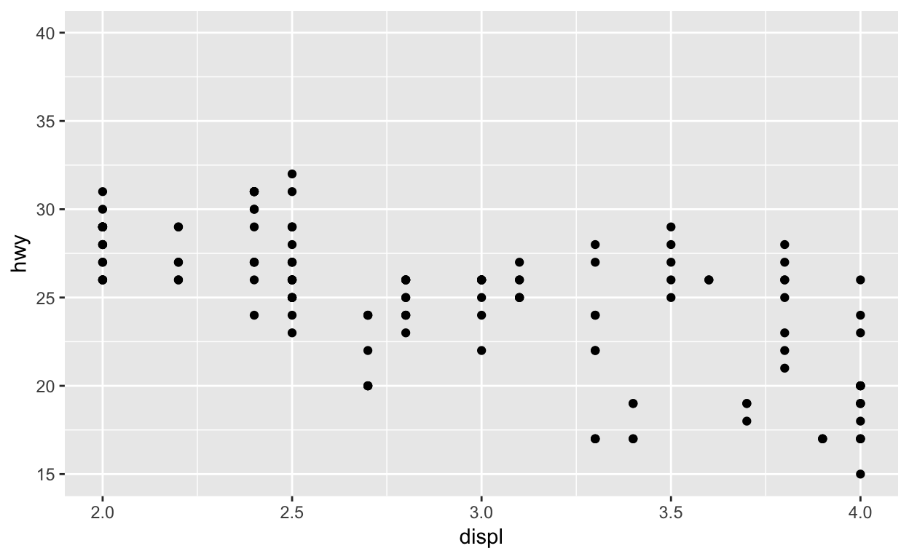

```{r setup, include=FALSE}
knitr::opts_chunk$set(echo = TRUE)
```

This tutorial will give an introduction on how to use R to produce graphs such as scatterplots, bar charts, histograms and boxplots. The use of graphics can help with the interpretation of large datasets and enhance reports.

We will use the ggplot package, which is a member of the tidyverse package, to produce plots of our data.

## Installing and Loading Packages
- Before we start we need to load the tidyverse package.
- To do so run the following line of code:

    `install.packages("tidyverse")`

- You then need to load the package by typing the following:

    `library(tidyverse)`

- **Note:** you only need to install a package once, however, you need to load it every time you start a new session and want to use that package. 

Alternatively, you can install and load packages in RStudio as follows:

- In the bottom right hand corner of the RStudio, select the **Packages** tab.

- Then click **Install** from the top left of the **Packages** window. 

- The following pop-up will appear:


- Enter the name of the package you wish to install in the packages box and select **install**. 

- Once the package is installed, you can load it by ticking the box beside the package name as shown below: 


```{r, echo=FALSE, message=FALSE, results='hide'}
library(tidyverse)
library(ggplot2)
```


## The Dataset
- R already has datasets available that we can graph.

- For this lesson we will use the `mpg` dataset from the tidyverse package. 

- It contains observations collected by the US Environmental Protection Agency on  different car models.

- Before we start to graph this dataset it is important to take a look at its contents.

- Running `mpg` will return the following:

```{r}
mpg
```

- The top line of the dataset shows the variable names with the following rows representing each individual observation. 

- Load the help file for the dataset (`?mpg`) to find more information on the data, including a description of the variables.

## Scatterplots

- We will start by producing a basic scatterplot of the `displ` (engine displacement in litres) and `cty` (city miles per gallon) variables. 

```{r firstScatter}
ggplot(data = mpg) + 
  geom_point(mapping = aes(x = displ, y = cty))
```

**Exercise 1: Produce a scatterplot with `displ` on the x-axis and `hwy` (highway miles per gallon) on the y-axis.**

## Graphing Template

`ggplot(data = <DATA>) + 
  <GEOM_FUNCTION>(mapping = aes(<MAPPINGS>))`
  
- The ggplot2 template takes the above form.

- The data (`<DATA>`) is passed as part of the ggplot function.

- The type of graph is defined by the function which follows (`<GEOM_FUNCTION>`). 
    - We have seen previously the `geom_point` function which creates a scatterplot.
    
    - There are different functions which create other type of graphs such as a bar chart `geom_bar`. 
    
- The `<MAPPINGS>` component defines which variables are plotted and can control other parts of the graph like the colour, size, etc...

## Scatterplots with Colour
- You can also produce scatterplots that are coloured.

- In the scatterplot below we have now coloured the data points using the `drv` variable. This means that data points will be coloured based on whether the car is a front-wheel drive, rear-wheel drive or four-wheel drive.

```{r scatterColour}
ggplot(data = mpg) + 
  geom_point(mapping = aes(x = displ, y = cty, colour = drv))
```

**Exercise 2: Colour the scatterplot created in Exercise 1 using the `class` variable.**

## Other Scatterplot Effects
- It is also possible to use variables to alter the shade and shape of scatterplots.

- Below are some examples of this.

```{r shade, message=FALSE, warning=FALSE}
ggplot(data = mpg) + 
  geom_point(mapping = aes(x = displ, y = cty, alpha = drv))
```


```{r shape}
ggplot(data = mpg) + 
  geom_point(mapping = aes(x = displ, y = cty, shape = drv))
```

- These are examples of just some of the changes you can make to scatterplots. Exploring the help file for `geom_point` will help you find out more about the function.

# Other Plots


## Different geom Types


- `geom_point` = scatterplot

- `geom_bar` = barplot

- `geom_histogram` = histogram  

- `geom_box` = boxplot


- See RStudio's [cheatsheet](https://www.rstudio.com/wp-content/uploads/2015/03/ggplot2-cheatsheet.pdf) for more information on different graph types and many other helpful tips.


## Diamonds data

- `Diamonds` is a dataset containing the prices and other attributes of almost 54,000 diamonds.

```{r}
diamonds
```

- Consult the help file for an explanation of the variables contained in the dataset.


## Basic Barplot

```{r basicBar}
ggplot(data = diamonds) + 
  geom_bar(mapping = aes(x = color))
```

**Exercise 3: Create a barplot of the `cut` variable.**

## Barplots with Colour

- You can colour a barplot depending on the variable being plotted as shown below:

```{r barColour}
ggplot(data = diamonds) + 
  geom_bar(mapping = aes(x = color, fill = color))
```

- Alternatively, you can colour the barplot using another variable:

```{r barColour2}
ggplot(data = diamonds) + 
  geom_bar(mapping = aes(x = color, fill = cut))
```

- Another interesting barplot iteration:

```{r barDodge}
ggplot(data = diamonds) + 
  geom_bar(mapping = aes(x = color, fill = cut), position = "dodge")
```

## Basic Histogram

```{r basicHist}
ggplot(diamonds) +
  geom_histogram(mapping = aes(price), binwidth = 250)
```

**Exercise 4: Create a histogram of price but this time set the `binwidth` parameter to 1000. What effect does this have on the resulting plot?**

## Histogram with Colour
```{r colourHist}
ggplot(diamonds) +
  geom_histogram(mapping = aes(price, fill = color), binwidth = 1000)
```

## Boxplots

- Boxplots are a very useful method of graphing data as they clearly show the distribution of data.

- Boxplots take the following format:


*Image sourced from www.flowingdata.com*


### Basic Boxplot

```{r basicBox}
ggplot(data = mpg) + 
  geom_boxplot(mapping = aes(x = drv, y = cty))
```

### Boxplot with Colour

```{r colourBox}
ggplot(data = mpg) + 
  geom_boxplot(mapping = aes(x = drv, y = cty, fill= drv))
```

- The legend to the right of the plot can be removed by using the `theme()` function.
  - Also note how the `mapping` argument will work when set inside `ggplot`.
  - The arguments are passed on to subsequent elements of the plot.

```{r noLegend}
ggplot(data = mpg, mapping = aes(x = drv, y = cty, fill= drv)) + 
  geom_boxplot() + 
  theme(legend.position="none")
```


# Styling

## Coordinates


### Axis Range
- It is possible to shorten or widen the range of both the x and y axis.  
- Modify `xlim` and `ylims` to see how they effect the plot.

```{r limits}
  ggplot(mpg) +
  geom_point(aes(displ, hwy)) +
  xlim(2, 4) + ylim(15, 40)
```



- It's possible to specify more control on the axis using `scale_x_continuous` and `scale_y_continuous`.
    - The `limits` argument has the same effect as `xlim` and `ylim`.  
    - The `breaks` argument allows you to choose where to display numbers on the axes. 

```{r scales}
  ggplot(mpg) +
  geom_point(aes(displ, hwy)) +
  scale_x_continuous(limits = c(2, 4)) +
  scale_y_continuous(breaks = seq(15, 40, by = 5))
```

### Axis Flip

- The `coord_flip()` function will flip the x and y axis automatically.  
- This is useful to display boxplots vertically.

```{r coord_flip}
ggplot(data = mpg) + 
  geom_boxplot(aes(x = class, y = hwy)) +
  coord_flip()
```  


## Labels

- The `labs()` function is used to add title's and labels to the plot.  
    - `title` adds a main title.
    - `subtitle` adds additional detail in a smaller font beneath the title.
    - `caption` adds text at the bottom right of the plot, often used to describe the source of the data.

**Exercise 5: add a subtitle and caption to the plot below.**

```{r leabels1}
ggplot(mpg) +
  geom_point(aes(displ, hwy, color = class)) +
  labs(title = "Fuel efficiency generally decreases with engine size")
```


- You can also use `labs()` to replace the axis and legend titles. 
- It’s usually a good idea to replace short variable names with more detailed descriptions, and to include the units.

```{r labels2}
ggplot(mpg) +
  geom_point(aes(displ, hwy, colour = class)) +
  labs(x = "Engine displacement (L)",
       y = "Highway fuel economy (mpg)",
       colour = "Car type")
```  
  
  

## Themes

- Themes change the default colours.

- `theme_bw()`, `theme_light()`, `theme_classic()`, `theme_gray()` are just some examples.  
- Change the code to try some of the different themes.  

```{r standard_themes}
ggplot(mpg, aes(displ, hwy)) +
  geom_point(aes(color = class)) +
  theme_bw()
```


#### Custom Theme

- You can create your own custom theme.
- After saving your team as a variable it can be used with any plot.
    - See `my_edge_theme` as an example of this.

```{r edge_theme}
 # Edge colours from style guide
edge_pure_green <- rgb(0,160,100, maxColorValue = 255)
edge_pure_green20 <- rgb(204,236,224, maxColorValue = 255)
edge_deep_charcoal <- rgb(48,49,53, maxColorValue = 255)
edge_deep_charcoal50 <- rgb(151,152,154, maxColorValue = 255)
edge_deep_charcoal20 <- rgb(214,214,215, maxColorValue = 255)
edge_lime <- rgb(145,190,35, maxColorValue = 255)
edge_sea_blue <- rgb(15,120,160, maxColorValue = 255)


my_edge_theme <- theme(panel.background = element_rect(fill = edge_deep_charcoal20),
                       panel.border = element_rect(linetype = "solid", fill = NA),
                       panel.grid = element_line(colour = edge_deep_charcoal), 
                       plot.background = element_rect(fill = edge_deep_charcoal, colour = NA,size = 2),
                       text = element_text(family = "Arial", size=10, colour=edge_pure_green), 
                       title = element_text(family="Arial", size=15, colour=edge_pure_green),
                       axis.text= element_text(family="Arial", colour=edge_pure_green),
                       legend.background = element_rect(fill = "transparent",colour = NA), 
                       legend.key = element_rect(colour = edge_deep_charcoal50, fill = edge_pure_green))

ggplot(mpg, aes(displ, hwy)) +
  geom_point(color = edge_pure_green) +
  labs(title = "Engine size vs Highway fuel economy",
       x = "Engine displacement (L)",
       y = "Highway fuel economy (mpg)",
       colour = "Car type") + 
  my_edge_theme
```


- For more information and examples on how to use `ggplot2` to plot data, read the [data visualisation](http://r4ds.had.co.nz/data-visualisation.html) chapter from the [R for Data Science](http://r4ds.had.co.nz/index.html) book.