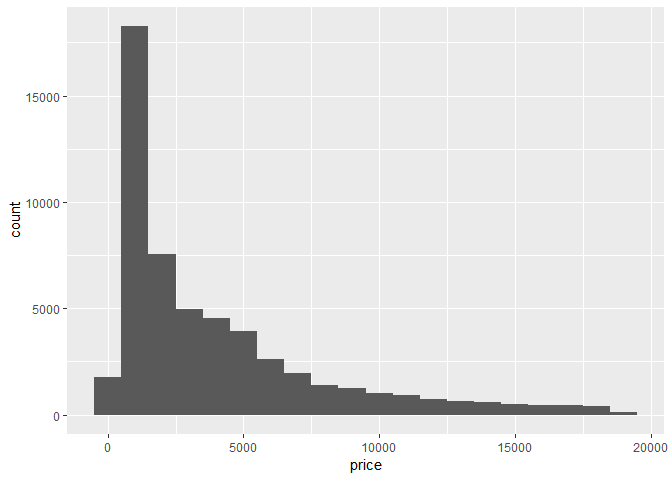

Tutorial 3: Solutions
================

### Exercise 1

``` r
ggplot(data = mpg) + 
  geom_point(mapping = aes(x = displ, y = hwy))
```


### Exercise 2

``` r
ggplot(data = mpg) + 
  geom_point(mapping = aes(x = displ, y = cty, colour= class))
```


### Exercise 3

``` r
ggplot(data = diamonds) + 
  geom_bar(mapping = aes(x = cut))
```


### Exercise 4

``` r
ggplot(diamonds, aes(price)) +
  geom_histogram(binwidth = 1000)
```


