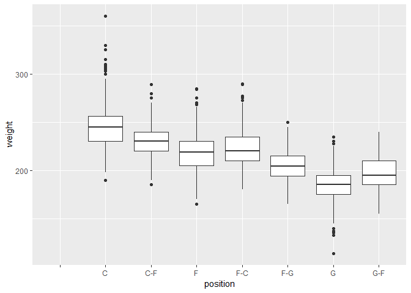
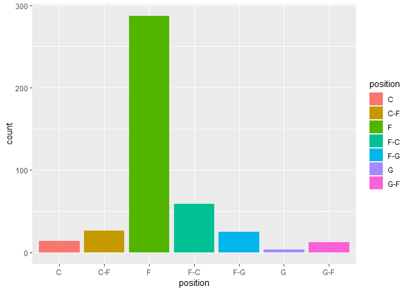
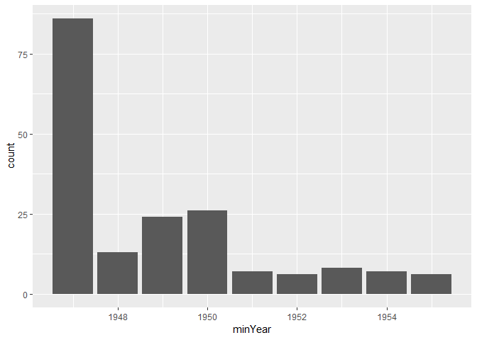

Tutorial 5: Solutions
================

### Exercise 1

``` r
library(nycflights13)
flights <- mutate(flights, kmPerMinute= distance/air_time)
```

### Exercise 2

``` r
byStartYear <- group_by(playerData, year_start)
summarise(byStartYear, maxYearEnd= max(year_end))
```

    ## # A tibble: 72 x 2
    ##    year_start maxYearEnd
    ##         <int>      <dbl>
    ##  1       1947       1956
    ##  2       1948       1962
    ##  3       1949       1962
    ##  4       1950       1964
    ##  5       1951       1970
    ##  6       1952       1960
    ##  7       1953       1964
    ##  8       1954       1964
    ##  9       1955       1968
    ## 10       1956       1966
    ## # ... with 62 more rows

### Exercise 3

``` r
byDestAndCarrier <- group_by(flights, dest, carrier)
summarise(byDestAndCarrier, averageDistance= mean(distance))
```

    ## # A tibble: 314 x 3
    ## # Groups:   dest [?]
    ##    dest  carrier averageDistance
    ##    <chr> <chr>             <dbl>
    ##  1 ABQ   B6                1826 
    ##  2 ACK   B6                 199 
    ##  3 ALB   EV                 143 
    ##  4 ANC   UA                3370 
    ##  5 ATL   9E                 759.
    ##  6 ATL   DL                 757.
    ##  7 ATL   EV                 746.
    ##  8 ATL   FL                 762 
    ##  9 ATL   MQ                 762 
    ## 10 ATL   UA                 746 
    ## # ... with 304 more rows

### Exercise 4

``` r
ggplot(data = playerData, mapping = aes(x= position, y = weight)) + 
  geom_boxplot()
```



### Exercise 5

``` r
players6ft8 <- filter(playerData, height == "6-8")
ggplot(data = players6ft8) + 
  geom_bar(mapping = aes(x = position, fill = position))
```



### Exercise 6

``` r
groupByCollege <- group_by(playerData, college)
minYearStart <- summarise(groupByCollege, minYear = min(year_start))
minYearStart <- filter(minYearStart, minYear<=1955)
ggplot(data = minYearStart) + 
  geom_bar(mapping = aes(x = minYear))
```


