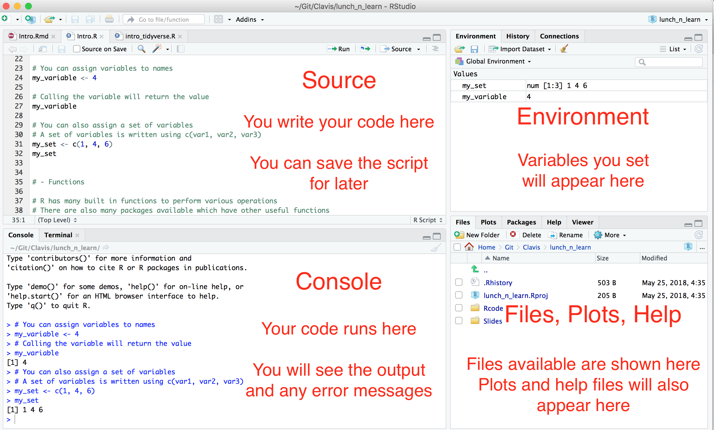
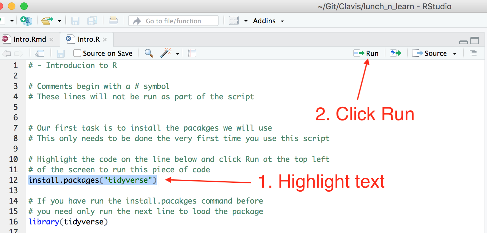

```{r setup, include=FALSE}
knitr::opts_chunk$set(echo = TRUE)
```

This first tutorial will give a brief introduction to R and Rstudio, instruct on how to download the necessary software and outline how to write basic R code. 

This is the first in a series of ten tutorials which will explain how to visualise data, perform basic statistical calculations and manipulate and clean data.Towards the end of the course, a tutorial will be provided on the use of Rmarkdown, a package which allows users to produce reports with visualisations easily integrated.  

A very useful resource is the [R for Data Science](http://r4ds.had.co.nz/index.html) book which is available for free online. This book covers the tidyverse packages and provides clear worked examples. The tidyverse packages contain useful visualisation, data manipulation and cleaning functions, many of which will be demonstrated in this course. 


## R and RStudio

- R is a the most popular programming language used in the field of statistics. It is a free software environment which can be used to perform data visualisations, data manipulation and a vast array of statistical methods. 

- RStudio is a more user friendly platform to write R code in. It allows users to save scripts containing their code and makes it easier to edit code. Displaying visualisations is also much more easily done using the RStudio platform.

- Download both R and RStudio using the following links. 

    - [https://www.r-project.org/](https://www.r-project.org/)

    - [https://www.rstudio.com/](https://www.rstudio.com/)  
    
- Ensure you download R before downloading RStudio.


## RStudio Layout

The RStudio interface is layed out as follows:


```{r, echo=FALSE,fig.align = 'center', out.width = '75%'}

```

## How to Run Code  

```{r, echo=FALSE,fig.align = 'center', out.width = '75%'}

```

- Alternatively those using Windows can run code chunks by highlighting the block of text and using the Ctrl+Enter keyboard shortcut. On a Mac it's Cmd+Enter. 


## Basic Operators in R
- Open up a new R script in RStudio by selecting **File > New File > R Script**.

- The R script is where you will write and edit all your code.

- Start off by entering the following basic calculations and running each line of code.

`6+3`

`8-2`

`2*5`

`6/3`

- The * and / symbols are the multiplication and division symbols in R.

## Variable assignment 
- When coding in R it is often useful to name an object. 

- The following code assigns the number `3` the name `myNumber`. If you want to access this number again at any point you can by simply typing `myNumber`.

```{r}
myNumber <- 3
```

- The `<-` symbol is similar to an equals sign in R.

- When naming an object you can not have spaces between words i.e. above we have named our variable `myNumber` as typing `my number` would have resulted in an error. Another alternative would have been to use an underscore in the name (`my_number`).

- Try running the following code:
```{r}
myNumber <- 5
```
- You will notice if you run `myNumber` now the value `5` will be printed in the console. This is because `myNumber` has now been reassigned the value `5`. 

## Vectors
- A vector is a sequence of data elements of the same basic type, for example a list of numbers or a list of names. 

- Members in a vector can also be referred to as components.

- A vector of variables (or components) is written using the form `c(var1, var2, var3)` in R.

- Try running the following code in R:

```{r}
numberVector <- c(1,5,6,2,10)
stringVector <- c("cat", "dog", "rabbit", "fish")
```
- In programming the word **string** refers to a sequence of characters i.e. a word or sentence. 

- Note that when making a vector of string variables it is necessary to put each variable in a set of speech marks.

- It is possible to select values from a vector by using the index of each variable. The third value in a vector would have an index of 3 for example.

```{r}
numberVector[3]
```

- When selecting multiple variables from a vector you need to input the indices of interest as a vector.

```{r}
numberVector[c(1,3,4,5)]
```

- The `:` can be used to quickly select multiple variables. For example, `3:5` would return the components whose indices were `3, 4` and `5`. See how the following code returns the same values as the code written above:

```{r}
numberVector[c(1,3:5)]
```


## Basic Functions
- R allows you to easily find the mean (average) of a group of numbers and their standard deviation (how much the numbers deviate from the mean on average) using the `mean()` and `sd()` functions. 

- Try running the following code:

`mean(numberVector)`

`sd(numberVector)`

- Repeat the above exercise but this time use the `stringVector` as the input to the functions. What happens?

- Other useful functions include the `median()`, `length()` and `sum()` functions.

- Try running the code below. What does each function do?

`median(numberVector)`

`length(stringVector)`

`sum(numberVector)`


## Working Directories
- Create a new folder on your desktop and name it **R Tutorials**.

- This is where you will save all your work from this course.

- Now you will set the working directory to this file in RStudio by selecting **Session > Set Working Directory > Choose Directory...** and then selecting the **R Tutorials** file.

- Later on in the course when you are reading in datasets to R you will see the benefits of using a working directory. For now just get in the habit of setting the working directory to the **R Tutorials** file at the start of each session. 


## The Help Function

- The help function is a very useful tool in R. 

- Adding a `?` before any function will load a help file on that function which details what it does, the parameters it takes and provides examples of its use.

- Run `?mean` and examine the help file shown.

## Matrices in R
- A matrix is a two dimensional array of data. 

- A matrix is created in R using the `matrix` function which takes the format `matrix(data, nrow, ncol, byrow= FALSE)` where `data` is the input to the matrix, `nrow` is the number of rows in the matrix and `ncol` is the number of columns. By default the matrix is filled by column, however this can be changed to by row by setting the `byrow` parameter equal to `TRUE`. 

- Below is an example of how to create a basic matrix with the resulting matrix shown underneath:

```{r matix}
myMatrix <- matrix(c(1,3,4,7,2,1,9,5,3), nrow=3, ncol= 3)
myMatrix
```

**Exercise 1: Recreate the matrix shown below in R and name it `testScores`.**

```{r matrix2, echo=FALSE}
testScores <- matrix(c(70,43,81,59,75,59,88,63,68,46,83,61), nrow=4, ncol=3)
testScores
```

## Naming Rows and Columns
- It is possible to name the rows and columns in a matrix using the `rownames()` and `colnames()` functions.

- Firstly, name the columns in `testScores` by typing the following code:

```{r colnames}
colnames(testScores) <- c("Jan", "Feb", "Mar")
```

**Excerise 2: Name the rows in testScores Katie, Robert, Niamh and Nick.**
```{r rownames, echo=FALSE}
rownames(testScores) <- c("Katie", "Robert","Niamh", "Nick")

```

## Selecting values in a Matrix
- Similar to vectors, variables in a matrix are selected using indices. However this time to get a specific variable you must input two indices; the row index and the column index. 

- To select the value in the first row and third column of a matrix you would use the following format: `matrixName[1,3]`. Note that the row index is specified first and then column index second, after a comma. 

- Some examples of selecting values from matrices are shown below. Do you understand the output returned by each line of code?

```{r selectOne}
myMatrix[2,3]
```

```{r selectMutliple}
myMatrix[1:2,3]
```
- It is possible to select an entire row or column from a matrix.
```{r selectRow}
myMatrix[1,]
```
```{r selectColumn}
myMatrix[,2]
```

## Selecting Values using Row and Column Names
- One useful element of naming rows and columns is that they can be used to select variables in the matrix. This is especially useful when trying to access data in a large matrix. 

- Try running the code below yourself, checking that you get the same answers.

```{r}
testScores["Niamh","Feb"]
```

```{r}
testScores["Nick", c("Jan", "Mar")]
```

```{r}
testScores[,"Feb"]
```

## Rbind and Cbind 
- The `rbind` and `cbind` functions allow you to add rows and columns to an existing matrix respectively. 

- For example, if we wanted to add test scores from April to the existing `testScores` matrix we would do so as follows:
```{r addCol}
Apr <- c(72,53,85,64)
testScores <- cbind(testScores, Apr)
testScores
```
- Run the code above before starting Exercise 3.

**Exercise 3: The testScores matrix is missing a student named Lucy. Use the `rbind()` function to add her scores in. Lucy has test scores of 61, 64, 70 and 63 for the months of January, February, March and April respectively.**

```{r addRow, echo=FALSE}
Lucy <- c(61, 64, 70, 63)
testScores <- rbind(testScores, Lucy)
```

## The Apply Function
- The `apply()` function returns the result obtained when a set function is applied to a matrix.

- The function takes the following format: `apply(X, MARGIN, FUN)` where `X` is the matrix and `FUN` is the chosen function. The `MARGIN` parameter refers to whether you wish to apply the function to the rows or columns of the matrix. `MARGIN` is set to `1` for rows and `2` for columns.

- For example, if you wanted to find the average test score for each month you would do the following:

```{r}
apply(testScores, 2, mean)
```

**Exercise 4: Find each individuals max test score. Hint: use the `max()` function.**

## Editing Data in Matrix
- It is very easy to access and edit data in a matrix. 

- For example, from looking at the average test score values by month in `testScores`, it was thought that the January test must have been too hard. As a result, it was decided that each student would get 5 extra marks for their January test.

- The code below shows how to make the necessary charges to the matrix.

```{r}
testScores[,"Jan"] <- testScores[,"Jan"]+5
testScores
```

- The following exercises are more challenging that the previous ones. If you are comfortable with the material so far give them a go. 

**Exercise 5: It was discovered that Niamh's February test score was inputted incorrectly and should be 78 instead of 88. Make the necessary update to `testScores`.**

**Exercise 6: Robert has appealed his test scores and as a result has been granted a 20% increase in the marks received for each test. Update `testScores` with Robert's new result.**


