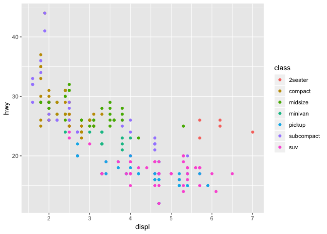

Tutorial 2: Data Visualisation
================

## Introduction

  - This interactive tutorial will give an introduction on how to use R
    to produce graphs such as scatterplots, bar charts, histograms and
    boxplots. The use of graphics can help with the interpretation of
    large datasets and enhance reports.

  - We will use the ggplot2 package, which is a member of the tidyverse
    package, to produce plots of our data.

  - This tutorial will introduce many techniques. For additional
    information and examples on how to use `ggplot2` to plot data, read
    the [data
    visualisation](http://r4ds.had.co.nz/data-visualisation.html)
    chapter from the [R for Data
    Science](http://r4ds.had.co.nz/index.html) book.

### Installing and Loading Packages

  - In order to run this interactive tutorial, you had to install a
    number of packages.

  - There are thousands of packages available for R, some more useful
    than others.

  - Packages can be installed using the `install.packages` command.
    
      - `install.packages("tidyverse")`

  - To then use the package you need to load it by typing the following:
    
      - `library(tidyverse)`

  - **Note:** you only need to install a package once, however, you need
    to load it every time you start a new session and want to use that
    package.

### `mpg` Dataset

  - R already has datasets available that we can graph.

  - For the beginning of this lesson we will use the `mpg` dataset from
    the tidyverse package.

  - It contains observations collected by the US Environmental
    Protection Agency on different car models.

  - Consult the helpfile which can be found
    [here](https://ggplot2.tidyverse.org/reference/mpg.html) to find
    more information on the data, including a description of the
    variables.

  - Before we start to graph this dataset it is important to take a look
    at its contents.

  - The box below is an active code environment.
    
      - We will use these throughout this tutorial.

  - Click the **run code** button at the top right of the code box to
    execute the code.

  - This runs the code in R in the background and displays the results
    here.

<!-- end list -->

``` r
head(mpg)
```

    ## # A tibble: 6 x 11
    ##   manufacturer model displ  year   cyl trans  drv     cty   hwy fl    class
    ##   <chr>        <chr> <dbl> <int> <int> <chr>  <chr> <int> <int> <chr> <chr>
    ## 1 audi         a4      1.8  1999     4 auto(… f        18    29 p     comp…
    ## 2 audi         a4      1.8  1999     4 manua… f        21    29 p     comp…
    ## 3 audi         a4      2    2008     4 manua… f        20    31 p     comp…
    ## 4 audi         a4      2    2008     4 auto(… f        21    30 p     comp…
    ## 5 audi         a4      2.8  1999     6 auto(… f        16    26 p     comp…
    ## 6 audi         a4      2.8  1999     6 manua… f        18    26 p     comp…

## Scatterplots

  - We will start by producing a basic scatterplot of the `displ`
    (engine displacement in litres) and `cty` (city miles per gallon)
    variables.

<!-- end list -->

``` r
ggplot(data = mpg) + 
  geom_point(mapping = aes(x = displ, y = cty))
```

<!-- -->

**Exercise: Produce a scatterplot with `displ` on the x-axis and `hwy`
(highway miles per gallon) on the y-axis.**

``` r
ggplot()
```

<!-- -->

``` r
ggplot(data = mpg) + 
  geom_point(mapping = aes(x = displ, y = hwy))
```

<!-- -->

### Graphing Template

`ggplot(data = <DATA>) + <GEOM_FUNCTION>(mapping = aes(<MAPPINGS>))`

  - The ggplot2 template takes the above form.
  - The data (`<DATA>`) is passed as part of the ggplot function.
  - The type of graph is defined by the function which follows
    (`<GEOM_FUNCTION>`).
      - We have seen previously the `geom_point` function which creates
        a scatterplot.
      - There are different functions which create other type of graphs
        such as a bar chart `geom_bar`.
  - The `<MAPPINGS>` component defines which variables are plotted and
    can control other parts of the graph like the colour, size, etc…

### Scatterplots with Colour

  - You can also produce scatterplots that are coloured.
  - In the scatterplot below we have now coloured the data points using
    the `drv` variable. This means that data points will be coloured
    based on whether the car is a front-wheel drive, rear-wheel drive or
    four-wheel drive.

<!-- end list -->

``` r
ggplot(data = mpg) + 
  geom_point(mapping = aes(x = displ, y = cty, colour = drv))
```

<!-- -->

**Exercise: Colour the scatterplot created in Exercise 1 using the
`class` variable.**

``` r
ggplot()
```

<!-- -->

``` r
ggplot(data = mpg) + 
  geom_point(mapping = aes(x = displ, y = hwy, colour = class))
```

<!-- -->

#### Note on colour

  - To colour all points in a plot the same colour, the argument must be
    outside the `aes` function.
  - Values inside the aes function are assumed to be variables.

**Exercise: Move the colour inside `aes` to see what happens.**

``` r
ggplot(data = mpg) + 
  geom_point(mapping = aes(x = displ, y = cty),  colour = "blue")
```

<!-- -->

``` r
ggplot(data = mpg) + 
  geom_point(mapping = aes(x = displ, y = cty,  colour = "blue"))
```

<!-- -->

### Other Scatterplot Effects

  - It is also possible to use variables to alter the shade and shape of
    scatterplots.
  - Below are some examples of this.

<!-- end list -->

``` r
ggplot(data = mpg) + 
  geom_point(mapping = aes(x = displ, y = cty, alpha = drv))
```

<!-- -->

``` r
ggplot(data = mpg) + 
  geom_point(mapping = aes(x = displ, y = cty, shape = drv))
```

<!-- -->

  - These are examples of just some of the changes you can make to
    scatterplots. Exploring the [help
    file](https://ggplot2.tidyverse.org/reference/geom_point.html) for
    `geom_point` will help you find out more about the function.

### Other Plots

#### Different geom Types

  - `geom_point` = scatterplot

  - `geom_bar` = barplot

  - `geom_histogram` = histogram

  - `geom_box` = boxplot

  - See RStudio’s
    [cheatsheet](https://www.rstudio.com/wp-content/uploads/2015/03/ggplot2-cheatsheet.pdf)
    for more information on different graph types and many other helpful
    tips.

## Barplots

### Diamonds data

  - `Diamonds` is a dataset containing the prices and other attributes
    of almost 54,000 diamonds.
  - Consult the help file
    [here](https://ggplot2.tidyverse.org/reference/diamonds.html) for an
    explanation of the variables contained in the dataset.

<!-- end list -->

``` r
head(diamonds)
```

    ## # A tibble: 6 x 10
    ##   carat cut       color clarity depth table price     x     y     z
    ##   <dbl> <ord>     <ord> <ord>   <dbl> <dbl> <int> <dbl> <dbl> <dbl>
    ## 1 0.23  Ideal     E     SI2      61.5    55   326  3.95  3.98  2.43
    ## 2 0.21  Premium   E     SI1      59.8    61   326  3.89  3.84  2.31
    ## 3 0.23  Good      E     VS1      56.9    65   327  4.05  4.07  2.31
    ## 4 0.290 Premium   I     VS2      62.4    58   334  4.2   4.23  2.63
    ## 5 0.31  Good      J     SI2      63.3    58   335  4.34  4.35  2.75
    ## 6 0.24  Very Good J     VVS2     62.8    57   336  3.94  3.96  2.48

### Basic Barplot

``` r
ggplot(data = diamonds) + 
  geom_bar(mapping = aes(x = color))
```

<!-- -->

**Exercise: Create a barplot of the `cut` variable.**

``` r
ggplot()
```

<!-- -->

``` r
ggplot(data = diamonds) + 
  geom_bar(mapping = aes(x = cut))
```

<!-- -->

### Barplots with Colour

  - You can colour a barplot depending on the variable being plotted as
    shown below:

<!-- end list -->

``` r
ggplot(data = diamonds) + 
  geom_bar(mapping = aes(x = color, fill = color))
```

<!-- -->

  - Alternatively, you can colour the barplot using another variable:

<!-- end list -->

``` r
ggplot(data = diamonds) + 
  geom_bar(mapping = aes(x = color, fill = cut))
```

<!-- -->

  - Another interesting barplot iteration:

<!-- end list -->

``` r
ggplot(data = diamonds) + 
  geom_bar(mapping = aes(x = color, fill = cut), position = "dodge")
```

<!-- -->

## Histograms

### Basic Histogram

``` r
ggplot(diamonds) +
  geom_histogram(mapping = aes(price), binwidth = 250)
```

<!-- -->

**Exercise: Create a histogram of price but this time set the `binwidth`
parameter to 1000. What effect does this have on the resulting plot?**

``` r
ggplot()
```

<!-- -->

``` r
ggplot(diamonds) +
  geom_histogram(aes(price), binwidth = 1000)
```

<!-- -->

## Boxplots

  - Boxplots are a very useful method of graphing data as they clearly
    show the distribution of data.
  - If you are unfamiliar with what a boxplot displays, a good
    explanation can be found
    [here](https://www.wellbeingatschool.org.nz/information-sheet/understanding-and-interpreting-box-plots).

### Basic Boxplot

``` r
ggplot(data = mpg) + 
  geom_boxplot(mapping = aes(x = drv, y = cty))
```

<!-- -->

### Boxplot with Colour

``` r
ggplot(data = mpg) + 
  geom_boxplot(mapping = aes(x = drv, y = cty, fill= drv))
```

<!-- -->

  - The legend to the right of the plot can be removed by using the
    `theme()` function.
      - Also note how the `mapping` argument will work when set inside
        `ggplot`.
      - The arguments are passed on to subsequent elements of the plot.

<!-- end list -->

``` r
ggplot(data = mpg, mapping = aes(x = drv, y = cty, fill= drv)) + 
  geom_boxplot() + 
  theme(legend.position="none")
```

<!-- -->

## Styling

### Coordinates

#### Axis Range

  - It is possible to shorten or widen the range of both the x and y
    axis.  
  - Modify `xlim` and `ylims` to see how they effect the plot.

<!-- end list -->

``` r
ggplot(mpg) +
  geom_point(aes(displ, hwy)) +
  xlim(2, 4) + ylim(15, 40)
```

<!-- -->

  - It’s possible to specify more control on the axis using
    `scale_x_continuous` and `scale_y_continuous`.
      - The `limits` argument has the same effect as `xlim` and
        `ylim`.  
      - The `breaks` argument allows you to choose where to display
        numbers on the axes.
  - Look at the solution to see another example of choosing where to
    display values.

<!-- end list -->

``` r
ggplot(mpg) +
  geom_point(aes(displ, hwy)) +
  scale_x_continuous(limits = c(2, 4)) +
  scale_y_continuous(breaks = seq(15, 40, by = 5))
```

<!-- -->

``` r
ggplot(mpg) +
  geom_point(aes(displ, hwy)) +
  scale_x_continuous(breaks = seq(1.5, 7, by= 0.5)) +
  scale_y_continuous(breaks = c(10, 15, 20, 25, 40))
```

<!-- -->

#### Axis Flip

  - The `coord_flip()` function will flip the x and y axis
    automatically.  
  - This is useful to display boxplots vertically.

**Exercise: Use `coord_flip()` to change the plot.**

``` r
ggplot(data = mpg) + 
  geom_boxplot(aes(x = class, y = hwy))
```

<!-- -->

``` r
ggplot(data = mpg) + 
  geom_boxplot(aes(x = class, y = hwy)) +
  coord_flip()
```

<!-- -->

### Labels

  - The `labs()` function is used to add title’s and labels to the plot.
      - `title` adds a main title.
      - `subtitle` adds additional detail in a smaller font beneath the
        title.
      - `caption` adds text at the bottom right of the plot, often used
        to describe the source of the data.

**Exercise: add a subtitle and caption to the plot below.**

``` r
ggplot(mpg) +
  geom_point(aes(displ, hwy, color = class)) +
  labs(title = "Fuel efficiency generally decreases with engine size")
```

<!-- -->

``` r
ggplot(mpg) +
  geom_point(aes(displ, hwy, color = class)) +
  labs(title = "Fuel efficiency generally decreases with engine size",
       subtitle = "Two seaters (sports cars) are an exception because of their light weight",
       caption = "Data from fueleconomy.gov")
```

<!-- -->

  - You can also use `labs()` to replace the axis and legend titles.
  - It’s usually a good idea to replace short variable names with more
    detailed descriptions, and to include the units.

<!-- end list -->

``` r
ggplot(mpg) +
  geom_point(aes(displ, hwy, colour = class)) +
  labs(x = "Engine displacement (L)",
       y = "Highway fuel economy (mpg)",
       colour = "Car type")
```

<!-- -->

### Themes

  - Themes change the default colours.

  - `theme_bw()`, `theme_light()`, `theme_classic()`, `theme_gray()` are
    just some examples.  

  - Change the code to try some of the different themes.

<!-- end list -->

``` r
ggplot(mpg, aes(displ, hwy)) +
  geom_point(aes(color = class)) +
  theme_bw()
```

<!-- -->

#### Custom Theme

  - You can create your own custom theme.
  - After saving your team as a variable it can be used with any plot.
      - See `my_edge_theme` as an example of this.

<!-- end list -->

``` r
 # Edge colours from style guide
edge_pure_green <- rgb(0,160,100, maxColorValue = 255)
edge_pure_green20 <- rgb(204,236,224, maxColorValue = 255)
edge_deep_charcoal <- rgb(48,49,53, maxColorValue = 255)
edge_deep_charcoal50 <- rgb(151,152,154, maxColorValue = 255)
edge_deep_charcoal20 <- rgb(214,214,215, maxColorValue = 255)
edge_lime <- rgb(145,190,35, maxColorValue = 255)
edge_sea_blue <- rgb(15,120,160, maxColorValue = 255)


my_edge_theme <- theme(panel.background = element_rect(fill = edge_deep_charcoal20),
                       panel.border = element_rect(linetype = "solid", fill = NA),
                       panel.grid = element_line(colour = edge_deep_charcoal), 
                       plot.background = element_rect(fill = edge_deep_charcoal, colour = NA,size = 2),
                       text = element_text(family = "Arial", size=10, colour=edge_pure_green), 
                       title = element_text(family="Arial", size=15, colour=edge_pure_green),
                       axis.text= element_text(family="Arial", colour=edge_pure_green),
                       legend.background = element_rect(fill = "transparent",colour = NA), 
                       legend.key = element_rect(colour = edge_deep_charcoal50, fill = edge_pure_green))

ggplot(mpg, aes(displ, hwy)) +
  geom_point(color = edge_pure_green) +
  labs(title = "Engine size vs Highway fuel economy",
       x = "Engine displacement (L)",
       y = "Highway fuel economy (mpg)",
       colour = "Car type") + 
  my_edge_theme
```

<!-- -->

### Facets

  - One way to add additional variables is with aesthetics (colour,
    shape, etc…). Another way, particularly useful for categorical
    variables, is to split your plot into facets, subplots that each
    display one subset of the data.

  - To facet your plot by a single variable, use `facet_wrap()`. The
    first argument of `facet_wrap()` should be a formula, which you
    create with `~` followed by a variable name (here “formula” is the
    name of a data structure in R, not a synonym for “equation”). The
    variable that you pass to `facet_wrap()` should be discrete.

<!-- end list -->

``` r
ggplot(data = mpg) +
  geom_point(mapping = aes(x = displ, y = hwy)) +
  facet_wrap(~ class, nrow = 2)
```

<!-- -->

  - To facet your plot on the combination of two variables, add
    `facet_grid()` to your plot call. The first argument of
    `facet_grid()` is also a formula. This time the formula should
    contain two variable names separated by a `~`.

<!-- end list -->

``` r
ggplot(data = mpg) +
  geom_point(mapping = aes(x = displ, y = hwy)) +
  facet_grid(drv ~ cyl)
```

<!-- -->

<!-- - What plots does the following code make? What does . do? -->

<!-- ```{r ex-facets } -->

<!-- ggplot(data = mpg) + -->

<!--   geom_point(mapping = aes(x = displ, y = hwy)) + -->

<!--   facet_grid(drv ~ .) -->

<!-- ggplot(data = mpg) + -->

<!--   geom_point(mapping = aes(x = displ, y = hwy)) + -->

<!--   facet_grid(. ~ cyl) -->

<!-- ``` -->

<!-- ```{r ex-facets-solution} -->

<!-- # The . refers to the dataset being used -->

<!-- # -->

<!-- # .$displ will access the displ variable -->

<!-- ``` -->

## Advanced

### Maps

  - This section uses the `maps` and `scales` packages.
  - `maps`
      - This packages contains maps which can be used to visualise
        geographical data.
  - `scales`
      - This package contains functions to improve axis labels and
        legends.

<!-- end list -->

``` r
library(maps)
library(scales)

tidy_tuesday5 <- readr::read_csv("https://raw.githubusercontent.com/rfordatascience/tidytuesday/master/data/2018/2018-04-30/week5_acs2015_county_data.csv")

 # County map data
counties <- map_data("county")

 # Combined county data
all_county <- tidy_tuesday5 %>% 
  mutate(County=tolower(County), State=tolower(State)) %>%
  inner_join(counties, by=c("County" = "subregion", "State" = "region"))
```

  - The code below loads some United States economic data, as well as
    map data for the US.  
  - We will cover some of the commands used below in later tutorials.

<!-- end list -->

``` r
 # Load data
tidy_tuesday5 <- read_csv("https://raw.githubusercontent.com/rfordatascience/tidytuesday/master/data/2018/2018-04-30/week5_acs2015_county_data.csv")

 # County map data
counties <- map_data("county")  # data of coordinates of all counties in the US

 # Combined county data
all_county <- tidy_tuesday5 %>% 
  mutate(County=tolower(County), State=tolower(State)) %>%  # change county and state name to lowercase
  inner_join(counties, by=c("County" = "subregion", "State" = "region"))

all_county  # explore data
```

    ## # A tibble: 86,284 x 41
    ##    CensusId State County TotalPop   Men Women Hispanic White Black Native
    ##       <dbl> <chr> <chr>     <dbl> <dbl> <dbl>    <dbl> <dbl> <dbl>  <dbl>
    ##  1     1001 alab… autau…    55221 26745 28476      2.6  75.8  18.5    0.4
    ##  2     1001 alab… autau…    55221 26745 28476      2.6  75.8  18.5    0.4
    ##  3     1001 alab… autau…    55221 26745 28476      2.6  75.8  18.5    0.4
    ##  4     1001 alab… autau…    55221 26745 28476      2.6  75.8  18.5    0.4
    ##  5     1001 alab… autau…    55221 26745 28476      2.6  75.8  18.5    0.4
    ##  6     1001 alab… autau…    55221 26745 28476      2.6  75.8  18.5    0.4
    ##  7     1001 alab… autau…    55221 26745 28476      2.6  75.8  18.5    0.4
    ##  8     1001 alab… autau…    55221 26745 28476      2.6  75.8  18.5    0.4
    ##  9     1001 alab… autau…    55221 26745 28476      2.6  75.8  18.5    0.4
    ## 10     1001 alab… autau…    55221 26745 28476      2.6  75.8  18.5    0.4
    ## # … with 86,274 more rows, and 31 more variables: Asian <dbl>,
    ## #   Pacific <dbl>, Citizen <dbl>, Income <dbl>, IncomeErr <dbl>,
    ## #   IncomePerCap <dbl>, IncomePerCapErr <dbl>, Poverty <dbl>,
    ## #   ChildPoverty <dbl>, Professional <dbl>, Service <dbl>, Office <dbl>,
    ## #   Construction <dbl>, Production <dbl>, Drive <dbl>, Carpool <dbl>,
    ## #   Transit <dbl>, Walk <dbl>, OtherTransp <dbl>, WorkAtHome <dbl>,
    ## #   MeanCommute <dbl>, Employed <dbl>, PrivateWork <dbl>,
    ## #   PublicWork <dbl>, SelfEmployed <dbl>, FamilyWork <dbl>,
    ## #   Unemployment <dbl>, long <dbl>, lat <dbl>, group <dbl>, order <int>

  - We can create a heatmap coloured according to *Income*.
  - Try and change *Income* to a different variable such as
    *Unemployment* or *MeanCommute*.
      - You may need to change the `labels` argument inside the
        `scales_fill_distiller`.
      - See the solution for an
example.

<!-- end list -->

``` r
ggplot(data = all_county, mapping = aes(x = long, y = lat, group = group)) + 
  coord_fixed(1.3) + # ensure the right aspect of the map
  geom_polygon(aes_string(fill = "Income"), color = "grey", size = 0.05) + # use grey lines to outline the counties
  scale_fill_distiller(palette = "Spectral", labels = dollar) +            # use spectral colour scheme and add dollar sign to variable
  theme_void() +  # this theme removes all background lines
  theme(plot.margin = unit(c(0,0,0,0), "cm"))  # allows the map to take up the full space of the plot
```

<!-- -->

``` r
ggplot(data = all_county, mapping = aes(x = long, y = lat, group = group)) + 
  coord_fixed(1.3) + 
  geom_polygon(aes_string(fill = "MeanCommute"), color = "grey", size = 0.05) +
  scale_fill_distiller(palette = "Spectral", labels = number_format(suffix = "mins")) +
  theme_void() +
  theme(plot.margin = unit(c(0,0,0,0), "cm"))
```

<!-- -->

### Animate `gganimate`

  - We will now look at the `gganimtte` package.
  - This can be used to create animations of data.

<!-- end list -->

``` r
library(gganimate)
library(scales)

 # Load data
voter_data <- read_csv("https://raw.githubusercontent.com/rfordatascience/tidytuesday/master/data/2018/2018-10-09/voter_turnout.csv")

 # Remove unwanted entries
state_data <- voter_data %>% 
  filter(!state %in% c("United States", "United States (Excl. Louisiana)"))  # Remove overall country voter data
  # mutate(year = as.Date(as.character(year), format="%Y"))  # must be better way to do this
```

  - The data used here is [US Voter
    Data](https://github.com/rfordatascience/tidytuesday/tree/master/data/2018/2018-10-09),
    click on the link to learn more about the data.

<!-- end list -->

``` r
 # Load data
voter_data <- read_csv("https://raw.githubusercontent.com/rfordatascience/tidytuesday/master/data/2018/2018-10-09/voter_turnout.csv")

 # Remove overall country voter data
state_data <- voter_data %>% 
  filter(!state %in% c("United States", "United States (Excl. Louisiana)"))

state_data 
```

    ## # A tibble: 918 x 7
    ##       X1  year icpsr_state_code alphanumeric_st… state  votes
    ##    <dbl> <dbl>            <dbl>            <dbl> <chr>  <dbl>
    ##  1     2  2014               41                1 Alab… 1.19e6
    ##  2     3  2014               81                2 Alas… 2.85e5
    ##  3     4  2014               61                3 Ariz… 1.54e6
    ##  4     5  2014               42                4 Arka… 8.53e5
    ##  5     6  2014               71                5 Cali… 7.51e6
    ##  6     7  2014               62                6 Colo… 2.08e6
    ##  7     8  2014                1                7 Conn… 1.10e6
    ##  8     9  2014               11                8 Dela… 2.38e5
    ##  9    10  2014               55                9 Dist… 1.77e5
    ## 10    11  2014               43               10 Flor… 6.03e6
    ## # … with 908 more rows, and 1 more variable: eligible_voters <dbl>

  - The plot begins as a standard ggplot.

<!-- end list -->

``` r
 # Create base plot for animation
ggplot(state_data, aes(votes, eligible_voters, colour = state)) +
  geom_point(show.legend = FALSE) + theme_light() +
  scale_y_continuous(labels = comma_format()) +  # comma_format from scales package, neat axis labels
  scale_x_continuous(labels = comma_format()) +
  labs(title = 'Eligible voters vs Number of votes',
       y = 'Eligible voters', x = 'Votes')
```

<!-- -->

#### Animation

  - We add to the ggplot to create the animation.
  - The `transtion_time` argument selects which variable to animate
    over.
  - Note `{round(frame-time)}` as part of the subtitle.
      - This is specific to gganimate.
      - The subtitle will change as the year changes.
  - **This chunk of code may take up to 60 seconds to
complete**

<!-- end list -->

``` r
votes_vs_eligible <- ggplot(state_data, aes(votes, eligible_voters, colour = state)) +
  geom_point(show.legend = FALSE) + theme_light() +
  scale_y_continuous(labels = comma_format()) +
  scale_x_continuous(labels = comma_format()) +
  labs(title = 'Eligible voters vs Number of votes', 
       subtitle = 'Year: {round(frame_time)}',
       y = 'Eligible voters', x = 'Votes') +
  # extra lines needed for animation are below
  transition_time(year) +
  ease_aes('quartic-in-out')  # determines how points will move

animate(votes_vs_eligible)
```

<!-- -->

### Map Animation

  - We can combine the `maps` and `gganimate` packages.

<!-- end list -->

``` r
library(gganimate)
library(scales)
library(maps)
states = map_data("state") 


turbine_data <- read_csv("https://raw.githubusercontent.com/rfordatascience/tidytuesday/master/data/2018/2018-11-06/us_wind.csv", na=c("n/a", "-9999", "missing"))

turbine_data <- turbine_data %>% 
  filter(!is.na(p_year))
```

  - The final animation looks at [US Wind Turbine
    Data](https://github.com/rfordatascience/tidytuesday/tree/master/data/2018/2018-11-06)

<!-- end list -->

``` r
states = map_data("state") 

turbine_data <- read_csv("https://raw.githubusercontent.com/rfordatascience/tidytuesday/master/data/2018/2018-11-06/us_wind.csv", na=c("n/a", "-9999", "missing"))

turbine_data <- turbine_data %>% 
  filter(!is.na(p_year))  # remove NAs

turbine_data
```

    ## # A tibble: 58,123 x 24
    ##    case_id faa_ors faa_asn usgs_pr_id t_state t_county t_fips p_name p_year
    ##      <dbl> <chr>   <chr>        <dbl> <chr>   <chr>    <chr>  <chr>   <dbl>
    ##  1 3073429 <NA>    <NA>          4960 CA      Kern Co… 06029  251 W…   1987
    ##  2 3071522 <NA>    <NA>          4997 CA      Kern Co… 06029  251 W…   1987
    ##  3 3073425 <NA>    <NA>          4957 CA      Kern Co… 06029  251 W…   1987
    ##  4 3071569 <NA>    <NA>          5023 CA      Kern Co… 06029  251 W…   1987
    ##  5 3005252 <NA>    <NA>          5768 CA      Kern Co… 06029  251 W…   1987
    ##  6 3003862 <NA>    <NA>          5836 CA      Kern Co… 06029  251 W…   1987
    ##  7 3073370 <NA>    <NA>          4948 CA      Kern Co… 06029  251 W…   1987
    ##  8 3010101 <NA>    <NA>          5828 CA      Kern Co… 06029  251 W…   1987
    ##  9 3073324 <NA>    <NA>          4965 CA      Kern Co… 06029  251 W…   1987
    ## 10 3072659 <NA>    <NA>          5044 CA      Kern Co… 06029  251 W…   1987
    ## # … with 58,113 more rows, and 15 more variables: p_tnum <dbl>,
    ## #   p_cap <dbl>, t_manu <chr>, t_model <chr>, t_cap <dbl>, t_hh <dbl>,
    ## #   t_rd <dbl>, t_rsa <dbl>, t_ttlh <dbl>, t_conf_atr <dbl>,
    ## #   t_conf_loc <dbl>, t_img_date <chr>, t_img_srce <chr>, xlong <dbl>,
    ## #   ylat <dbl>

  - Notice below how the `ggplot` function is left blank
      - The *states* data and *turbine* data are used separately inside
        the plotting functions
  - **This chunk of code may take up to 60 seconds to complete**

<!-- end list -->

``` r
location_animation <- ggplot() + 
      geom_polygon(data = states, 
                   aes(x=long, y = lat, group=group), fill = NA, color = "black") +  # add outline of US and states
      geom_point(data = turbine_data, 
                 aes(x = xlong, y = ylat), color = "blue3", size = 0.7) +  # turbine location plot
  coord_fixed(1.3) + 
  xlim(range(states$long)) + 
  ylim(range(states$lat)) + 
  theme_void() +
  labs(title = "Location of wind turbines in the USA",
       subtitle = 'Year: {round(frame_time)}') +
  transition_time(p_year) + 
  shadow_mark(colour ='blue')  # animations settings, shdow_mark sticks points onto the map

animate(location_animation, nframes = length(unique(turbine_data$p_year)), fps = 1, width=800, height=800)  # create animation
```

<!-- -->
