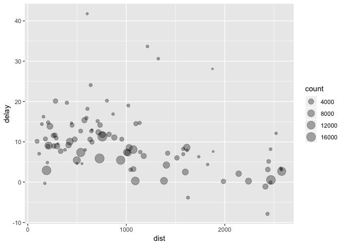
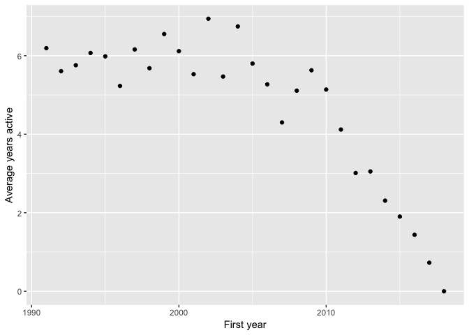
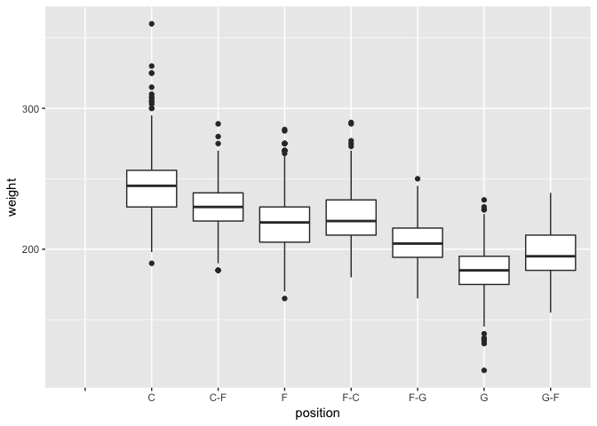
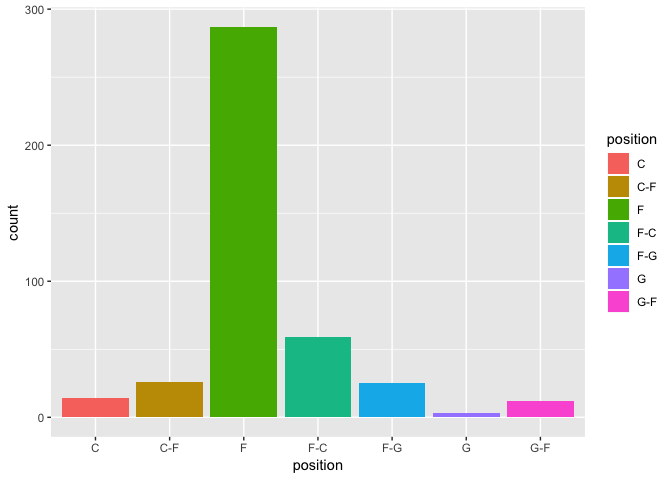
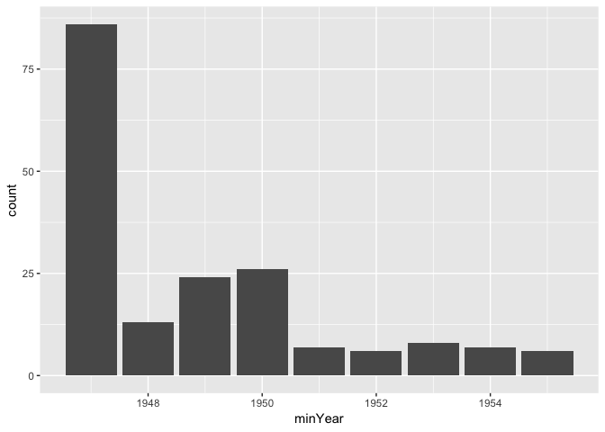

Tutorial 3
================

## Introduction

This weeks tutorial will show you how to read in datasets to R, save
datasets as files and deal with missing data. We will also look at the
`filter()`, `arrange()` and `select()` functions which are useful for
data transformation. We will also look at the `group_by()` and
`summarise()` functions which are useful for creating summary
statistics. We will finish off looking at the concept of the pipe
operator which helps to create *readable* code.

### Loading Datasets

  - The function used to read in the individual files depends on the
    file type.
      - `read.table()` can be used for reading in most file types which
        contain data in a table format. The function takes the form
        `read.table(file, header= FALSE, sep= "")` where `file` is the
        name of the file. The default value for `header` is `FALSE`,
        which means that the function assumes the data read in does not
        have a heading. If this is not the case simply set
        `header=TRUE`. The `sep` parameter assumes that the data is
        separated in the file by a space, tab or new line. However, if
        the data is separated by a `;` for example, set `sep= ";"`.
    
      - `read.csv()` is used for reading in csv files. The function
        takes the form `read.csv(file, header= TRUE, sep=",")`. Note
        that `read.csv()` assumes the data has a heading, however you
        can change this by setting `header= FALSE`. Also it assumes that
        the data is separated by a `,` but this parameter can also be
        changed.
    
      - `load()` is used for reading in `.Rdata` files.
  - In the examples below we are reading directly from the Github
    repository online.  
  - **In practice you will be reading from a location on your local
    machine.**
      - e.g. `read.table("user/downloads/pulse.txt", header =
TRUE)`

<!-- end list -->

``` r
pulseData <- read.table("https://raw.githubusercontent.com/kellya72/R-tutorials/master/Tutorial%204/pulse.txt", header = TRUE)
# pulseData 
```

``` r
fastFoodData <- read.csv("https://raw.githubusercontent.com/kellya72/R-tutorials/master/Tutorial%204/fastfood_calories.csv", header = TRUE)
# fastFoodData
```

``` r
oliveData <- load(url("https://github.com/kellya72/R-tutorials/blob/master/Tutorial%204/olive.Rdata?raw=true"))
# oliveData 
```

  - When reading in data, it is useful to assign names to the input as
    then the datasets can easily be included in other
functions.

<!-- -   As the files were saved in the working directory **R Tutorials**, only the file name was needed in the function. However, if the file was saved in another location, the full filepath would need to be included e.g. `read.table("user/downloads/pulse.txt")`. You must use forward slashes in the file path, R will return an error if backwards slashes are used. -->

### Saving Datasets

  - It is also possible to save datasets created or worked on in R as
    files.

  - The `write.table()` function can be used to do this. The function
    takes the form `write.table(x, file, sep = " ")` where `x` is the
    name of the dataset in R and `file` is name of the file you wish to
    create. The `sep` parameter once again is the method by which each
    row of data is separated in the resulting file, with the default
    separator set to a space.
    
      - Since this is an interactive tutorial we won’t run the
        write.table command.
      - `write.table(pulseData, "savedPulse.txt")` would save the
        `pulseData` data.

  - The `write.csv()` is an alternative function which will save the
    data in a comma separated form. The function takes the form
    `write.csv(x, file,)` where `x` is the name of the dataset in R and
    `file` is name of the file you wish to create.

## Missing Data

  - Datasets often can contain missing data.

  - The `complete.cases()` function is used to identify the rows of data
    which are complete i.e. do not contain missing data.

  - Sometimes it is helpful to take a closer look at cases with missing
    data as opposed to just deleting them.

  - Run the following code to find any missing data in the `pulseData`
    dataframe and save them in a new dataframe called `missingData`.

<!-- end list -->

``` r
missingData <- filter(pulseData, !complete.cases(pulseData))
```

  - The `!` in R is a negative operator, i.e. the code above is
    searching for cases that are **not** complete.

  - We will cover the `filter` function in the next section.

### Analysing the Missing Data

  - The `summary()` function is useful for quickly analysing a dataset.

<!-- end list -->

``` r
summary(missingData)
```

    ##  RestingPulse  Smokes      Weight     
    ##  High:2       No  :4   Min.   :125.0  
    ##  Low :2       Yes :0   1st Qu.:128.2  
    ##  NA's:3       NA's:3   Median :139.0  
    ##                        Mean   :137.2  
    ##                        3rd Qu.:143.8  
    ##                        Max.   :150.0  
    ##                        NA's   :1

### Removing Missing Data

  - After analysing the cases which contain missing elements, sometimes
    we then wish to remove them from our original dataset.

**Exercise 2: Use the `complete.cases()` function to create a new
dataframe called `cleanPulseData` which contains no missing data.**

``` r
cleanPulseData <- pulseData
head(cleanPulseData)
```

    ##   RestingPulse Smokes Weight
    ## 1          Low     No    140
    ## 2          Low   <NA>    145
    ## 3          Low    Yes    160
    ## 4          Low    Yes    190
    ## 5          Low     No    155
    ## 6          Low     No    165

``` r
cleanPulseData  <- filter(pulseData, complete.cases(pulseData))
```

  - An alternative method of removing missing data is to use the
    `na.omit()` function:
      - Note how the use of `na.omit` differs to `complete.cases`
      - It is a standalone function which returns a dataset

<!-- end list -->

``` r
cleanPulseData <- na.omit(pulseData)
head(cleanPulseData)
```

    ##   RestingPulse Smokes Weight
    ## 1          Low     No    140
    ## 3          Low    Yes    160
    ## 4          Low    Yes    190
    ## 5          Low     No    155
    ## 6          Low     No    165
    ## 8          Low     No    190

## Data Transformation

  - The `filter()`, `arrange()` and `select()` functions are from the
    `dplyr` package which is a member of the `tidyverse` packages.

### `filter()`

  - The `filter()` function allows you to easily subset observations
    based on their values.

  - There are a number of different comparison operators which can be
    used.
    
      - `<`, `>` less than, greater than.
      - `<=`, `>=` less than or equal to, greater than or equal to.
      - `==` equal to.
      - `!=` not equal.

  - The data to be subsetted is first specified and the subsequent
    arguments are the expressions that filter the data frame.

  - For example, you may wish to create a subset of cases from
    `cleanPulseData` containing only individuals who smoke and weigh
    over 160.

<!-- end list -->

``` r
smokersOver160 <- filter(cleanPulseData, 
                         RestingPulse == "Low", 
                         Smokes == "Yes", 
                         Weight > 160)
head(smokersOver160)
```

    ##   RestingPulse Smokes Weight
    ## 1          Low    Yes    190
    ## 2          Low    Yes    175
    ## 3          Low    Yes    170
    ## 4          Low    Yes    180
    ## 5          Low    Yes    185
    ## 6          Low    Yes    170

**Exercise 3: Create a subset from `cleanPulseData` which contains
individuals with a low resting pulse who do not smoke and weight less
than 180. Name the subset `lowRateNonSmokers`.**

``` r
lowRateNonSmokers <- filter(cleanPulseData, 
                            Smokes == "No", 
                            Weight < 180)
head(lowRateNonSmokers)
```

    ##   RestingPulse Smokes Weight
    ## 1          Low     No    140
    ## 2          Low     No    155
    ## 3          Low     No    165
    ## 4          Low     No    138
    ## 5          Low     No    155
    ## 6          Low     No    145

**Exercise 4: Create a subset containing individuals with a weight that
is less than or equal to 170.**

``` r
lessThanOrEqualTo170 <- filter(cleanPulseData, 
                               Weight <= 170)
head(lessThanOrEqualTo170)
```

    ##   RestingPulse Smokes Weight
    ## 1          Low     No    140
    ## 2          Low    Yes    160
    ## 3          Low     No    155
    ## 4          Low     No    165
    ## 5          Low     No    138
    ## 6         High    Yes    160

### `arrange()`

  - The `arrange()` function sorts and orders the contents of a
    dataframe.

<!-- end list -->

``` r
weightOrder <- arrange(cleanPulseData, Weight)
head(weightOrder)
```

    ##   RestingPulse Smokes Weight
    ## 1         High     No     95
    ## 2          Low     No    102
    ## 3          Low    Yes    108
    ## 4          Low     No    108
    ## 5          Low     No    110
    ## 6          Low    Yes    112

  - The data frame is arranged in ascending order by default. However,
    you can sort the data by descending order using the following code:

<!-- end list -->

``` r
weightOrderDesc <- arrange(cleanPulseData, desc(Weight))
head(weightOrderDesc)
```

    ##   RestingPulse Smokes Weight
    ## 1          Low     No    215
    ## 2          Low     No    195
    ## 3          Low    Yes    190
    ## 4          Low     No    190
    ## 5          Low     No    190
    ## 6          Low    Yes    190

  - It is also possible to include more than one column name in the
    `arrange()` function.

<!-- end list -->

``` r
smokesAndPulseOrder <- arrange(cleanPulseData, Smokes, RestingPulse)
head(smokesAndPulseOrder)
```

    ##   RestingPulse Smokes Weight
    ## 1         High     No    116
    ## 2         High     No    155
    ## 3         High     No    145
    ## 4         High     No    136
    ## 5         High     No    130
    ## 6         High     No    118

**Exercise 5: Run the above function again but this time input
`RestingPulse` into the function before `Smokes`. What effect does this
have on the resulting dataset.**

``` r
pulseAndSmokesOrder <- arrange(cleanPulseData, RestingPulse, Smokes)
head(pulseAndSmokesOrder)
```

    ##   RestingPulse Smokes Weight
    ## 1         High     No    116
    ## 2         High     No    155
    ## 3         High     No    145
    ## 4         High     No    136
    ## 5         High     No    130
    ## 6         High     No    118

### `select()`

  - The `select()` function allows you select only the variables you are
    interested in from a data frame.

  - For example, some datasets may contain hundreds of variables but you
    may only wish to analyse a few of them.

  - `fastFoodData` has 18 variables for each of its 515 observations.
    The code below shows how the `select()` function can be used to
    create a new dataset with less variables.

<!-- end list -->

``` r
fastFoodDataSimplified <- select(fastFoodData, 
                                 restaurant, 
                                 item, 
                                 calories)
head(fastFoodDataSimplified)
```

    ##   restaurant                                      item calories
    ## 1  Mcdonalds          Artisan Grilled Chicken Sandwich      380
    ## 2  Mcdonalds            Single Bacon Smokehouse Burger      840
    ## 3  Mcdonalds            Double Bacon Smokehouse Burger     1130
    ## 4  Mcdonalds Grilled Bacon Smokehouse Chicken Sandwich      750
    ## 5  Mcdonalds  Crispy Bacon Smokehouse Chicken Sandwich      920
    ## 6  Mcdonalds                                   Big Mac      540

**Exercise 6: Use the `select()` function to create a data frame called
`fastFoodNutrition` which contains the variables `restaurant`, `item`,
`calories`, `total_fat`, `sugar` and `protein`.**

``` r
fastFoodNutrition <- select(fastFoodData, 
                            restaurant, 
                            item, 
                            calories, 
                            total_fat, 
                            sugar, 
                            protein)
head(fastFoodNutrition)
```

    ##   restaurant                                      item calories total_fat
    ## 1  Mcdonalds          Artisan Grilled Chicken Sandwich      380         7
    ## 2  Mcdonalds            Single Bacon Smokehouse Burger      840        45
    ## 3  Mcdonalds            Double Bacon Smokehouse Burger     1130        67
    ## 4  Mcdonalds Grilled Bacon Smokehouse Chicken Sandwich      750        31
    ## 5  Mcdonalds  Crispy Bacon Smokehouse Chicken Sandwich      920        45
    ## 6  Mcdonalds                                   Big Mac      540        28
    ##   sugar protein
    ## 1    11      37
    ## 2    18      46
    ## 3    18      70
    ## 4    18      55
    ## 5    18      46
    ## 6     9      25

## More Transformations

The `playerData` dataset has been pre-loaded. Explore the data below.

``` r
head(playerData)
```

    ##                  name year_start year_end position height weight
    ## 1      Alaa Abdelnaby       1991     1995      F-C   6-10    240
    ## 2     Zaid Abdul-Aziz       1969     1978      C-F    6-9    235
    ## 3 Kareem Abdul-Jabbar       1970     1989        C    7-2    225
    ## 4  Mahmoud Abdul-Rauf       1991     2001        G    6-1    162
    ## 5   Tariq Abdul-Wahad       1998     2003        F    6-6    223
    ## 6 Shareef Abdur-Rahim       1997     2008        F    6-9    225
    ##          birth_date                               college
    ## 1     June 24, 1968                       Duke University
    ## 2     April 7, 1946                 Iowa State University
    ## 3    April 16, 1947 University of California, Los Angeles
    ## 4     March 9, 1969            Louisiana State University
    ## 5  November 3, 1974             San Jose State University
    ## 6 December 11, 1976              University of California

There are further helpful functions for data transformation such as
`mutate()`, `transmutate()`, `group_by()` and `ungroup()`. These
functions will then be used in conjunction with functions from the
previous section.

### `mutate()`

  - The `mutate()` function allows you create new columns (variables)
    that are functions of existing columns and adds them to the
    dataframe.

  - For example, the `playerData` dataset has two variables `year_start`
    and `year_end` which represent the year a player started their
    career and the year they stopped playing professionally. It is
    therefore possible to add a new column `years_active` to the
    existing dataset by doing the following:

<!-- end list -->

``` r
playerData <- mutate(playerData, years_active = year_end - year_start)

head(select(playerData, name, years_active))
```

    ##                  name years_active
    ## 1      Alaa Abdelnaby            4
    ## 2     Zaid Abdul-Aziz            9
    ## 3 Kareem Abdul-Jabbar           19
    ## 4  Mahmoud Abdul-Rauf           10
    ## 5   Tariq Abdul-Wahad            5
    ## 6 Shareef Abdur-Rahim           11

  - It is possible to create multiple new variables within the same
    `mutate()` function using the following format: `mutate(data,
    newVariable1, newVariable2, newVariable3, ...)`.

### `transmute()`

  - If you only wish to keep the new variables you have created, you can
    do so using the `transmute()` function as shown
below:

<!-- end list -->

``` r
transmute_example <- transmute(playerData, years_active = year_end - year_start)
head(transmute_example)
```

    ##   years_active
    ## 1            4
    ## 2            9
    ## 3           19
    ## 4           10
    ## 5            5
    ## 6           11

### NYC Flights

  - The [nycflights13](https://github.com/hadley/nycflights13) data
    contains information about all flights that departed from NYC
    (e.g. EWR, JFK and LGA) in 2013 (336,776 flights in total).

<!-- end list -->

``` r
flights
```

    ## # A tibble: 336,776 x 19
    ##     year month   day dep_time sched_dep_time dep_delay arr_time
    ##    <int> <int> <int>    <int>          <int>     <dbl>    <int>
    ##  1  2013     1     1      517            515         2      830
    ##  2  2013     1     1      533            529         4      850
    ##  3  2013     1     1      542            540         2      923
    ##  4  2013     1     1      544            545        -1     1004
    ##  5  2013     1     1      554            600        -6      812
    ##  6  2013     1     1      554            558        -4      740
    ##  7  2013     1     1      555            600        -5      913
    ##  8  2013     1     1      557            600        -3      709
    ##  9  2013     1     1      557            600        -3      838
    ## 10  2013     1     1      558            600        -2      753
    ## # … with 336,766 more rows, and 12 more variables: sched_arr_time <int>,
    ## #   arr_delay <dbl>, carrier <chr>, flight <int>, tailnum <chr>,
    ## #   origin <chr>, dest <chr>, air_time <dbl>, distance <dbl>, hour <dbl>,
    ## #   minute <dbl>, time_hour <dttm>

<br>

**Exercise 7: Add a new variable to the flights dataset called
`kmPerMinute` by dividing the `distance` variable by the `air_time`
variable.**

``` r
flights
```

    ## # A tibble: 336,776 x 19
    ##     year month   day dep_time sched_dep_time dep_delay arr_time
    ##    <int> <int> <int>    <int>          <int>     <dbl>    <int>
    ##  1  2013     1     1      517            515         2      830
    ##  2  2013     1     1      533            529         4      850
    ##  3  2013     1     1      542            540         2      923
    ##  4  2013     1     1      544            545        -1     1004
    ##  5  2013     1     1      554            600        -6      812
    ##  6  2013     1     1      554            558        -4      740
    ##  7  2013     1     1      555            600        -5      913
    ##  8  2013     1     1      557            600        -3      709
    ##  9  2013     1     1      557            600        -3      838
    ## 10  2013     1     1      558            600        -2      753
    ## # … with 336,766 more rows, and 12 more variables: sched_arr_time <int>,
    ## #   arr_delay <dbl>, carrier <chr>, flight <int>, tailnum <chr>,
    ## #   origin <chr>, dest <chr>, air_time <dbl>, distance <dbl>, hour <dbl>,
    ## #   minute <dbl>, time_hour <dttm>

``` r
flights <- mutate(flights, kmPerMinute= distance/air_time)
flights
```

    ## # A tibble: 336,776 x 20
    ##     year month   day dep_time sched_dep_time dep_delay arr_time
    ##    <int> <int> <int>    <int>          <int>     <dbl>    <int>
    ##  1  2013     1     1      517            515         2      830
    ##  2  2013     1     1      533            529         4      850
    ##  3  2013     1     1      542            540         2      923
    ##  4  2013     1     1      544            545        -1     1004
    ##  5  2013     1     1      554            600        -6      812
    ##  6  2013     1     1      554            558        -4      740
    ##  7  2013     1     1      555            600        -5      913
    ##  8  2013     1     1      557            600        -3      709
    ##  9  2013     1     1      557            600        -3      838
    ## 10  2013     1     1      558            600        -2      753
    ## # … with 336,766 more rows, and 13 more variables: sched_arr_time <int>,
    ## #   arr_delay <dbl>, carrier <chr>, flight <int>, tailnum <chr>,
    ## #   origin <chr>, dest <chr>, air_time <dbl>, distance <dbl>, hour <dbl>,
    ## #   minute <dbl>, time_hour <dttm>, kmPerMinute <dbl>

## Grouping

### `group_by()`

  - The `group_by()` function groups entries in a dataset by given
    variables.

  - This is particularly useful when used in conjunction with the
    `summarise()` function.
    
      - There are many useful summary functions which can be used inside
        the summarise.
      - `n()`, when used inside summarise this will count the number in
        each group.
      - `mean()` calculates the average of a variable across each group.
      - `min()`, `max()`, min and max values in the group.

  - Try running the following code which groups the players in the
    dataset by their college and then finds the average number of years
    players from different colleges are active.

<!-- end list -->

``` r
byCollege <- group_by(playerData, college)
summarise(byCollege, averageYearsActive = mean(years_active))
```

    ## # A tibble: 474 x 2
    ##    college                        averageYearsActive
    ##    <fct>                                       <dbl>
    ##  1 ""                                           4.54
    ##  2 Acadia University                            0   
    ##  3 Alabama - Huntsville                         0   
    ##  4 Alabama A&M University                       0   
    ##  5 Alabama State University                     1   
    ##  6 Albany State University                      8.6 
    ##  7 Alcorn State University                      6.25
    ##  8 Alliance College                             0   
    ##  9 American International College              10   
    ## 10 American University                         14   
    ## # … with 464 more rows

**Exercise 8: Group the dataset using the `year_start` variable and then
find the maximum `year_end` associated with each starting year.**

``` r
byStartYear <- group_by(playerData)
summarise(byStartYear)
```

    ## data frame with 0 columns and 0 rows

``` r
byStartYear <- group_by(playerData, year_start)
summarise(byStartYear, maxYearEnd = max(year_end))
```

    ## # A tibble: 72 x 2
    ##    year_start maxYearEnd
    ##         <int>      <dbl>
    ##  1       1947       1956
    ##  2       1948       1962
    ##  3       1949       1962
    ##  4       1950       1964
    ##  5       1951       1970
    ##  6       1952       1960
    ##  7       1953       1964
    ##  8       1954       1964
    ##  9       1955       1968
    ## 10       1956       1966
    ## # … with 62 more rows

**Exercise 9: Group the `flights` dataset by `dest` and `carrier` then
find the average distance for each grouping.**

``` r
byDestAndCarrier <- group_by(flights)
summarise(byDestAndCarrier)
```

    ## data frame with 0 columns and 0 rows

``` r
byDestAndCarrier <- group_by(flights, dest, carrier)
summarise(byDestAndCarrier, averageDistance = mean(distance))
```

    ## # A tibble: 314 x 3
    ## # Groups:   dest [?]
    ##    dest  carrier averageDistance
    ##    <chr> <chr>             <dbl>
    ##  1 ABQ   B6                1826 
    ##  2 ACK   B6                 199 
    ##  3 ALB   EV                 143 
    ##  4 ANC   UA                3370 
    ##  5 ATL   9E                 759.
    ##  6 ATL   DL                 757.
    ##  7 ATL   EV                 746.
    ##  8 ATL   FL                 762 
    ##  9 ATL   MQ                 762 
    ## 10 ATL   UA                 746 
    ## # … with 304 more rows

### `ungroup()`

  - If you wish to remove a grouping, you can do so simply by using the
    `ungroup()` function as follows:

<!-- end list -->

``` r
byCollege <- group_by(playerData, college)
ungroup(byCollege)
```

    ## # A tibble: 4,550 x 9
    ##    name  year_start year_end position height weight birth_date college
    ##    <fct>      <int>    <int> <fct>    <fct>   <int> <fct>      <fct>  
    ##  1 Alaa…       1991     1995 F-C      6-10      240 June 24, … Duke U…
    ##  2 Zaid…       1969     1978 C-F      6-9       235 April 7, … Iowa S…
    ##  3 Kare…       1970     1989 C        7-2       225 April 16,… Univer…
    ##  4 Mahm…       1991     2001 G        6-1       162 March 9, … Louisi…
    ##  5 Tari…       1998     2003 F        6-6       223 November … San Jo…
    ##  6 Shar…       1997     2008 F        6-9       225 December … Univer…
    ##  7 Tom …       1977     1981 F        6-7       220 May 6, 19… Indian…
    ##  8 Fore…       1957     1957 G        6-3       180 July 27, … Wester…
    ##  9 John…       1947     1948 F        6-3       195 February … Salem …
    ## 10 Alex…       2017     2018 G-F      6-6       190 August 1,… ""     
    ## # … with 4,540 more rows, and 1 more variable: years_active <int>

## Piping

  - The pipe operator is a powerful way to create readable code.

### Combining multiple operations with the pipe

  - We will look at the flight data again.
  - If we want to explore the relationship between distance and average
    delay for each location, we would write something similar to below.

<!-- end list -->

``` r
by_dest <- group_by(flights, dest)  # group by destination
delay <- summarise(by_dest,
  count = n(),  # number of flights
  dist = mean(distance, na.rm = TRUE),  # average distance
  delay = mean(arr_delay, na.rm = TRUE)  # average delay
)
delay <- filter(delay, count > 20, dest != "HNL")  # filter locations with more than 20 flights

 # Plot the data
ggplot(data = delay, mapping = aes(x = dist, y = delay)) +
  geom_point(aes(size = count), alpha = 1/3)
```

<!-- -->

  - There are three steps to prepare this data:
      - Group flights by destination.
      - Summarise to compute distance, average delay, and number of
        flights.
      - Filter to remove noisy points and Honolulu airport, which is
        almost twice as far away as the next closest airport
  - There’s another way to tackle the same problem with the pipe
    operator `%>%`.

### How `%>%` works

``` r
delay <- flights %>% 
  group_by(dest) %>% 
  summarise(
    count = n(),
    dist = mean(distance, na.rm = TRUE),
    delay = mean(arr_delay, na.rm = TRUE)
  ) %>% 
  filter(count > 20, dest != "HNL")

ggplot(data = delay, mapping = aes(x = dist, y = delay)) +
  geom_point(aes(size = count), alpha = 1/3)
```

<!-- -->

  - If we have a dataset `some_data` and a function `function_1(arg1,
    arg2)`

  - Normally we would use the function as follows:
    
      - `function_1(arg1 = some_data, arg2 = value)`

  - With the pipe operator we could call the function like so:
    
      - `some_data %>% function_1(arg2 = value)`

  - The pipe operator passes the input as the first argument to the next
    function.

  - Multiple functions can be used in sequence.

  - The results from a function will be passed on to the next function.
    
      - `some_data %>% function_1(f1_arg2 = value) %>%
        function_2(f2_arg2 = other_value)`

<br>

In exercise 9 we grouped the `flights` dataset by `dest` and `carrier`,
and then found the average distance for each grouping.  
**Exercise 10: Rewrite the code using the `%>%` operator.**

``` r
byDestAndCarrier <- group_by(flights, dest, carrier)
summarise(byDestAndCarrier, averageDistance = mean(distance))
```

    ## # A tibble: 314 x 3
    ## # Groups:   dest [?]
    ##    dest  carrier averageDistance
    ##    <chr> <chr>             <dbl>
    ##  1 ABQ   B6                1826 
    ##  2 ACK   B6                 199 
    ##  3 ALB   EV                 143 
    ##  4 ANC   UA                3370 
    ##  5 ATL   9E                 759.
    ##  6 ATL   DL                 757.
    ##  7 ATL   EV                 746.
    ##  8 ATL   FL                 762 
    ##  9 ATL   MQ                 762 
    ## 10 ATL   UA                 746 
    ## # … with 304 more rows

``` r
flights %>% 
  group_by(dest, carrier) %>%
  summarise(averageDistance = mean(distance))
```

    ## # A tibble: 314 x 3
    ## # Groups:   dest [?]
    ##    dest  carrier averageDistance
    ##    <chr> <chr>             <dbl>
    ##  1 ABQ   B6                1826 
    ##  2 ACK   B6                 199 
    ##  3 ALB   EV                 143 
    ##  4 ANC   UA                3370 
    ##  5 ATL   9E                 759.
    ##  6 ATL   DL                 757.
    ##  7 ATL   EV                 746.
    ##  8 ATL   FL                 762 
    ##  9 ATL   MQ                 762 
    ## 10 ATL   UA                 746 
    ## # … with 304 more rows

## Data Visualisation

  - Before plotting a graph it is often useful to employ some data
    manipulation techniques on a dataframe.

  - This allows us to create plots that are more specific which can aid
    us in data analysis.

  - Before continuing on it might be helpful to look over **Tutorial 3**
    to recap on plotting using `ggplot`.

  - This section should help to consolidate what you have already
    learned while also incorporating the new techniques from this week.

### Example 1

Look at the following code. Do you understand what the functions are
doing and what the resulting graph is representing?

``` r
averageYearsActive <- playerData %>% 
  filter(year_start > 1990) %>%
  mutate(years_active = year_end - year_start) %>%
  group_by(year_start) %>% 
  summarise(meanYearsActive = mean(years_active))

ggplot(data = averageYearsActive) + 
  geom_point(mapping = aes(x = year_start, y = meanYearsActive)) +
  labs(x= "First year", y = "Average years active")
```

<!-- -->

``` r
 # The plot shows the average years active vs the first year a player played
 # For players who begun playing after 1990 only

 # As you might expect, the average years active drops for players who begun after 2010
```

**Exercise 11: Using `playerData` create a boxplot comparing a players
position and their weight. Note: In some cases players have switched
positions and therefore their position values are equal to `G-F`, `F-C`
etc. Do not alter the values, simply consider `G-F` as a seperate group
to `G` and `F`.**

``` r
ggplot(data = playerData, mapping = aes(x= position, y = weight)) + 
  geom_boxplot()
```

    ## Warning: Removed 6 rows containing non-finite values (stat_boxplot).

<!-- -->

**Exercise 12: Create a bar plot using the positions variable but only
for players of height of 6-8. Colour the bars based on the position.**

``` r
playerData %>% 
  filter(height == "6-8") %>%
  ggplot() + 
  geom_bar(mapping = aes(x = position, fill = position))
```

<!-- -->

**Exercise 32: Group `playerData` by `college` and find the minimum
`year_start` for each college. Create a bar plot of the number of
colleges for each minimum start year up to and including 1955.**

``` r
playerData %>% 
  group_by(college) %>% 
  summarise(minYear = min(year_start)) %>% 
  filter(minYear<=1955) %>% 
  ggplot() + 
  geom_bar(mapping = aes(x = minYear))
```

<!-- -->

For more information and examples on the functions used in this weeks
tutorial and how to incorporate them in graphs, read the [data
transformation](https://r4ds.had.co.nz/transform.html) and the
[exploratory data
analysis](https://r4ds.had.co.nz/exploratory-data-analysis.html)
chapters from the [R for Data Science](http://r4ds.had.co.nz/index.html)
book.
