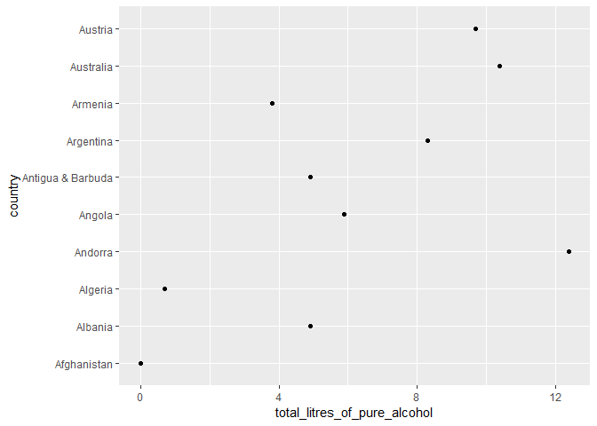
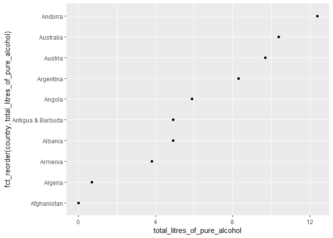

Tutorial 9: Factors
================

This weeks tutorial will focus on factors. Factors are used for categorical variables. Categorical variables are variables which can take one of a limited and usually fixed number of possible outcomes. The colour of a car, blood group and breed of a dog are all examples of categorical variables. Sometimes variables are recoded into categories of categorical variables for data analysis purposes. For example, a dataset of houses might have a variable representing its price. The price variable can be altered so it instead labels the house as either 'cheap', 'average' or 'expensive' dependent on a specified range i.e all houses under 200,000 euro are labelled as cheap. The price variable is then considered to be a categorical variable.

The `forcats` Package
---------------------

-   The `forcats` package contains many useful functions for dealing with factors in R.

-   You can read about all the functions contained in the package and their uses [here](https://cran.r-project.org/web/packages/forcats/forcats.pdf).

-   Install and load the package in RStudio.

-   Ensure you also load the `tidyverse` package.

Introduction to Factors
-----------------------

-   Some categorical variables such as the days of the week or months have a rank order.

-   As you can see below, if these variables are not defined as factors then they are sorted by R alphabetically as opposed to their correct natural order.

``` r
days <- c("Monday", "Thursday", "Sunday", "Friday", "Saturday")
sort(days)
```

    ## [1] "Friday"   "Monday"   "Saturday" "Sunday"   "Thursday"

-   This issue can be rectified by formatting the values as factors:

``` r
daysLevels <- c("Monday", "Tuesday", "Wednesday", "Thursday", "Friday", "Saturday", "Sunday")
daysAsFactors <- factor(days, levels = daysLevels)
sort(daysAsFactors)
```

    ## [1] Monday   Thursday Friday   Saturday Sunday  
    ## Levels: Monday Tuesday Wednesday Thursday Friday Saturday Sunday

-   The `daysLevels` vector represents all the possible values for the `days` variable and the correct order for the variable.

-   Factors are also useful as they prevent the input of incorrect values for the variable and human error:

``` r
days2 <- c("Tuesday", "Moday", "Saturday", "Sunday", "July")
days2AsFactors <- factor(days2, levels= daysLevels)
days2AsFactors
```

    ## [1] Tuesday  <NA>     Saturday Sunday   <NA>    
    ## Levels: Monday Tuesday Wednesday Thursday Friday Saturday Sunday

-   As you can see the incorrect values are relabelled `NA`. You can find out more information about the incorrect values using the `parse_factor()` function.

``` r
days2AsFactors <- parse_factor(days2, levels = daysLevels)
```

    ## Warning: 2 parsing failures.
    ## row col           expected actual
    ##   2  -- value in level set  Moday
    ##   5  -- value in level set  July

-   If given a dataset containing factors you can return the levels of the variable as follows:

``` r
levels(days2AsFactors)
```

    ## [1] "Monday"    "Tuesday"   "Wednesday" "Thursday"  "Friday"    "Saturday" 
    ## [7] "Sunday"

-   This is useful as you may be dealing with datasets with thousands of observations. The `levels()` function allows you to quickly find out all the possible values of a given categorical variable.

The `alcohol_consumption` Dataset
---------------------------------

-   Download and read in alcohol\_consumption.csv found in the **Tutorial 9** folder.

-   Alternatively you can read in the dataset directly using the dataset url as shown below.

``` r
alcoholData <- read.csv("https://raw.githubusercontent.com/rfordatascience/tidytuesday/master/data/2018/2018-06-26/week13_alcohol_global.csv")
```

`fct_reorder()`
---------------

-   `alcoholData` contains details of alcohol consumption in 195 different countries.

-   We want to display the `total_litres_of_pure_alcohol` variable in a scatterplot.

-   As the dataset is so large for our example we will only plot the first 10 countries.

``` r
subsetAlcohol <- alcoholData[1:10,]
ggplot(subsetAlcohol, aes(total_litres_of_pure_alcohol, country)) + geom_point()
```



-   This plot would be easier to interpret if the countries were sorted based on the `total_litres_of_pure_alcohol` variable. This can be done using the `fct_reorder()` function.

``` r
ggplot(subsetAlcohol, aes(total_litres_of_pure_alcohol, fct_reorder(country,total_litres_of_pure_alcohol ))) + geom_point()
```



**Exercise 1: Randomly select 10 countries from the `alcoholData` dataset. Produce a scatterplot of with the `country` variable on y-axis and `spirit_servings` on the x-axis, ensuring that the countries are sorted based on their `spirit_servings` value. Hint: Use the `sample()` function to randomly select the countries.**

Recoding Factors
----------------

### `fct_recode()`

-   The `fct_recode()` function allows you to change the values of the levels and even to reduce the number of levels by renaming multiple levels to the same name.

-   The `thanksgivingMeal` dataset contains details about what different families eat for their Thanksgiving meal.

``` r
thanksgivingMeal <- read.csv("https://raw.githubusercontent.com/rfordatascience/tidytuesday/master/data/2018/2018-11-20/thanksgiving_meals.csv")
levels(thanksgivingMeal$main_dish)
```

    ## [1] "Chicken"                "Ham/Pork"              
    ## [3] "I don't know"           "Other (please specify)"
    ## [5] "Roast beef"             "Tofurkey"              
    ## [7] "Turducken"              "Turkey"

-   By using the `levels()` function you can see all the different values for the `main_dish` variable.

-   You may want to adust the values for the `main_dish` variable.

``` r
thanksgivingMeal$main_dish <- fct_recode(thanksgivingMeal$main_dish, "Beef"="Roast beef", "Other (please specify)"= "Turducken")
levels(thanksgivingMeal$main_dish)
```

    ## [1] "Chicken"                "Ham/Pork"              
    ## [3] "I don't know"           "Other (please specify)"
    ## [5] "Beef"                   "Tofurkey"              
    ## [7] "Turkey"

**Exercise 2: Take a look at the different values for the `main_dish_other` variable. Use the `fct_recode()` function to tidy up some of the values so that the data will be cleaner and therefore subsequent analysis will be easier.**

### `fct_collapse()`

-   Sometimes you may want to rename a number of values to just one single value in order to simplify data.

-   While this can be done using the `fct_recode()` function it is often quicker to use `fct_collapse()`.

``` r
levels(thanksgivingMeal$kids_table_age)
```

    ##  [1] "10 or younger" "11"            "12"            "13"           
    ##  [5] "14"            "15"            "16"            "17"           
    ##  [9] "18"            "19"            "20"            "21 or older"

``` r
thanksgivingMeal$kids_table_age <- fct_collapse(thanksgivingMeal$kids_table_age, "11 to 15" = c("11", "12", "13", "14", "15"), "16 to 20"= c("16", "17", "18", "19", "20") )
levels(thanksgivingMeal$kids_table_age)
```

    ## [1] "10 or younger" "11 to 15"      "16 to 20"      "21 or older"

**Exercise 3: Use the `fct_collapse()` function to reduce the number of different values in the `main_prep_other` variable.**

The `summary()` Function
------------------------

-   The `summary()` function is a quick and easy way to gain an overall snapshot of a large dataset.

-   You can input the whole dataset or just a single variable of interest into the function.

``` r
summary(thanksgivingMeal)
```

    ##        id            celebrate                  main_dish  
    ##  Min.   :4.336e+09   No : 78   Turkey                :859  
    ##  1st Qu.:4.336e+09   Yes:980   Other (please specify): 38  
    ##  Median :4.337e+09             Ham/Pork              : 29  
    ##  Mean   :4.337e+09             Tofurkey              : 20  
    ##  3rd Qu.:4.337e+09             Chicken               : 12  
    ##  Max.   :4.338e+09             (Other)               : 16  
    ##                                NA's                  : 84  
    ##                                    main_dish_other
    ##  Prime Rib                                 :   2  
    ##  seafood                                   :   2  
    ##  Turkey and Ham                            :   2  
    ##  A turkey and a ham. Always.               :   1  
    ##  A wild game bird which changes every year.:   1  
    ##  (Other)                                   :  27  
    ##  NA's                                      :1023  
    ##                   main_prep            main_prep_other
    ##  Baked                 :481   Smoked           :   8  
    ##  Fried                 : 47   Grilled          :   6  
    ##  I don't know          : 17   smoked           :   5  
    ##  Other (please specify): 51   grilled          :   4  
    ##  Roasted               :378   1 fried 1 roasted:   1  
    ##  NA's                  : 84   (Other)          :  27  
    ##                               NA's             :1007  
    ##                    stuffing               stuffing_other
    ##  Bread-based           :836   cornbread          :   6  
    ##  None                  : 60   Cornbread          :   3  
    ##  Other (please specify): 36   Asian styled       :   1  
    ##  Rice-based            : 42   Both bread and rice:   1  
    ##  NA's                  : 84   Chestnuts, sausage :   1  
    ##                               (Other)            :  24  
    ##                               NA's               :1022  
    ##                   cranberry                   cranberry_other  gravy    
    ##  Canned                :502   Both Canned and Homemade:   2   No  : 82  
    ##  Homemade              :301   both canned and homemade:   1   Yes :892  
    ##  None                  :146   Both canned and homemade:   1   NA's: 84  
    ##  Other (please specify): 25   canned and homemade     :   1             
    ##  NA's                  : 84   Canned and homemade     :   1             
    ##                               (Other)                 :  19             
    ##                               NA's                    :1033             
    ##              side1         side2             side3      side4    
    ##  Brussel sprouts:155   Carrots:242   Cauliflower: 88   Corn:464  
    ##  NA's           :903   NA's   :816   NA's       :970   NA's:594  
    ##                                                                  
    ##                                                                  
    ##                                                                  
    ##                                                                  
    ##                                                                  
    ##        side5             side6                                  side7    
    ##  Cornbread:235   Fruit salad:215   Green beans/green bean casserole:686  
    ##  NA's     :823   NA's       :843   NA's                            :372  
    ##                                                                          
    ##                                                                          
    ##                                                                          
    ##                                                                          
    ##                                                                          
    ##                  side8                 side9                side10   
    ##  Macaroni and cheese:206   Mashed potatoes:817   Rolls/biscuits:766  
    ##  NA's               :852   NA's           :241   NA's          :292  
    ##                                                                      
    ##                                                                      
    ##                                                                      
    ##                                                                      
    ##                                                                      
    ##     side11                side12                            side13   
    ##  Squash:171   Vegetable salad:209   Yams/sweet potato casserole:631  
    ##  NA's  :887   NA's           :849   NA's                       :427  
    ##                                                                      
    ##                                                                      
    ##                                                                      
    ##                                                                      
    ##                                                                      
    ##                     side14                   side15       pie1    
    ##  Other (please specify):111   broccoli          :  8   Apple:514  
    ##  NA's                  :947   rice              :  4   NA's :544  
    ##                               Broccoli casserole:  3              
    ##                               collard greens    :  3              
    ##                               Rice              :  3              
    ##                               (Other)           : 90              
    ##                               NA's              :947              
    ##          pie2          pie3            pie4                pie5     
    ##  Buttermilk:  35   Cherry:113   Chocolate:133   Coconut cream:  36  
    ##  NA's      :1023   NA's  :945   NA's     :925   NA's         :1022  
    ##                                                                     
    ##                                                                     
    ##                                                                     
    ##                                                                     
    ##                                                                     
    ##        pie6         pie7         pie8          pie9              pie10    
    ##  Key lime:  39   Peach:  34   Pecan:342   Pumpkin:729   Sweet Potato:152  
    ##  NA's    :1019   NA's :1024   NA's :716   NA's   :329   NA's        :906  
    ##                                                                           
    ##                                                                           
    ##                                                                           
    ##                                                                           
    ##                                                                           
    ##   pie11                         pie12             pie13    
    ##  None:  40   Other (please specify): 71   Chess      :  4  
    ##  NA's:1018   NA's                  :987   Mincemeat  :  3  
    ##                                           Lemon      :  2  
    ##                                           mince meat :  2  
    ##                                           minced meat:  2  
    ##                                           (Other)    : 58  
    ##                                           NA's       :987  
    ##           dessert1       dessert2        dessert3          dessert4  
    ##  Apple cobbler:110   Blondies:  16   Brownies:128   Carrot cake: 72  
    ##  NA's         :948   NA's    :1042   NA's    :930   NA's       :986  
    ##                                                                      
    ##                                                                      
    ##                                                                      
    ##                                                                      
    ##                                                                      
    ##        dessert5      dessert6    dessert7         dessert8  
    ##  Cheesecake:191   Cookies:204   Fudge:  43   Ice cream:266  
    ##  NA's      :867   NA's   :854   NA's :1015   NA's     :792  
    ##                                                             
    ##                                                             
    ##                                                             
    ##                                                             
    ##                                                             
    ##           dessert9   dessert10                   dessert11  
    ##  Peach cobbler:103   None:295   Other (please specify):134  
    ##  NA's         :955   NA's:763   NA's                  :924  
    ##                                                             
    ##                                                             
    ##                                                             
    ##                                                             
    ##                                                             
    ##        dessert12    prayer   
    ##  pie        : 13   No  :335  
    ##  Pie        : 12   Yes :624  
    ##  pies       :  6   NA's: 99  
    ##  pumpkin pie:  4             
    ##  Pumpkin pie:  4             
    ##  (Other)    : 95             
    ##  NA's       :924             
    ##                                                                               travel   
    ##  Thanksgiving is happening at my home--I won't travel at all                     :396  
    ##  Thanksgiving is local--it will take place in the town I live in                 :276  
    ##  Thanksgiving is out of town and far away--I have to drive several hours or fly  : 82  
    ##  Thanksgiving is out of town but not too far--it's a drive of a few hours or less:197  
    ##  NA's                                                                            :107  
    ##                                                                                        
    ##                                                                                        
    ##        watch_program       kids_table_age hometown_friends friendsgiving
    ##  Macy's Parade:502   10 or younger:518    No  :594         No  :683     
    ##  NA's         :556   11 to 15     :198    Yes :357         Yes :268     
    ##                      16 to 20     : 70    NA's:107         NA's:107     
    ##                      21 or older  :165                                  
    ##                      NA's         :107                                  
    ##                                                                         
    ##                                                                         
    ##  black_friday work_retail     work_black_friday  community_type
    ##  No  :727     No  :881    Doesn't apply:  7     Rural   :216   
    ##  Yes :224     Yes : 70    No           : 20     Suburban:496   
    ##  NA's:107     NA's:107    Yes          : 43     Urban   :236   
    ##                           NA's         :988     NA's    :110   
    ##                                                                
    ##                                                                
    ##                                                                
    ##       age         gender                 family_income
    ##  18 - 29:216   Female:544   $25,000 to $49,999  :180  
    ##  30 - 44:259   Male  :481   Prefer not to answer:136  
    ##  45 - 59:286   NA's  : 33   $50,000 to $74,999  :135  
    ##  60+    :264                $75,000 to $99,999  :133  
    ##  NA's   : 33                $100,000 to $124,999:111  
    ##                             (Other)             :330  
    ##                             NA's                : 33  
    ##               us_region  
    ##  South Atlantic    :214  
    ##  Middle Atlantic   :159  
    ##  East North Central:150  
    ##  Pacific           :146  
    ##  West South Central: 91  
    ##  (Other)           :239  
    ##  NA's              : 59

``` r
summary(thanksgivingMeal$family_income)
```

    ##         $0 to $9,999   $10,000 to $24,999 $100,000 to $124,999 
    ##                   66                   68                  111 
    ## $125,000 to $149,999 $150,000 to $174,999 $175,000 to $199,999 
    ##                   49                   40                   27 
    ##      $200,000 and up   $25,000 to $49,999   $50,000 to $74,999 
    ##                   80                  180                  135 
    ##   $75,000 to $99,999 Prefer not to answer                 NA's 
    ##                  133                  136                   33

-   The `thanksgivingMeal` dataset only contains categorical data. The `summary()` function provides a lot of useful statistical data for numerical data also.

``` r
summary(mpg$hwy)
```

    ##    Min. 1st Qu.  Median    Mean 3rd Qu.    Max. 
    ##   12.00   18.00   24.00   23.44   27.00   44.00
