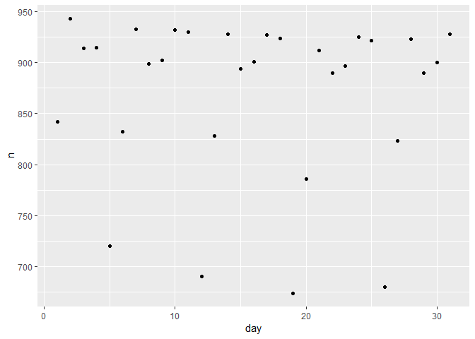

Tutorial 8: Solutions
================

### Exercise 1

``` r
str_length(mpg$model)
```

    ##   [1]  2  2  2  2  2  2  2 10 10 10 10 10 10 10 10 10 10 10 18 18 18 18 18
    ##  [24]  8  8  8  8  8 15 15 15 15  6  6  6  6  6 11 11 11 11 11 11 11 11 11
    ##  [47] 11 11 17 17 17 17 17 17 17 17 17 11 11 11 11 11 11 11 19 19 19 19 19
    ##  [70] 19 19 19 19 19 14 14 14 12 12 12 12 12 12 15 15 15 15 15 15 15  7  7
    ##  [93]  7  7  7  7  7  7  7  5  5  5  5  5  5  5  5  5  6  6  6  6  6  6  6
    ## [116]  7  7  7  7  7  7  7 18 18 18 18 18 18 18 18 11 11 11 11 13 13 13 15
    ## [139] 15 15 15  6  6  6  6  6  6  6  6  6 14 14 14 14 10 10 10 10 10 12 12
    ## [162] 12 12 12 12 11 11 11 11 11 11 11 11 11 11 11 11 11 11  5  5  5  5  5
    ## [185]  5  5 12 12 12 12 12 12 12  7  7  7  7  7 22 22 17 17 17 17 17 17 17
    ## [208]  3  3  3  3  3  5  5  5  5  5  5  5  5  5 10 10 10 10 10 10  6  6  6
    ## [231]  6  6  6  6

### Exercise 2

``` r
str_c(mpg$manufacturer[1], mpg$model[1],sep = ":")
```

    ## [1] "audi:a4"

Or

``` r
str_c(mpg[1, "manufacturer"], mpg[1,"model"], sep = ":")
```

    ## [1] "audi:a4"

### Exercise 3

``` r
sum(str_detect(mpg$manufacturer, "au"))
```

    ## [1] 18

### Exercise 4

``` r
mpg$model <- str_replace_all(mpg$model, c("toyota tacoma 4wd"= "tacoma 4wd", "new beetle"= "beetle"))
```

### Exercise 5

``` r
count(mpg, manufacturer)
```

    ## # A tibble: 15 x 2
    ##    manufacturer     n
    ##    <chr>        <int>
    ##  1 audi            18
    ##  2 chevrolet       19
    ##  3 dodge           37
    ##  4 ford            25
    ##  5 honda            9
    ##  6 hyundai         14
    ##  7 jeep             8
    ##  8 land rover       4
    ##  9 lincoln          3
    ## 10 mercury          4
    ## 11 nissan          13
    ## 12 pontiac          5
    ## 13 subaru          14
    ## 14 toyota          34
    ## 15 volkswagen      27

### Exercise 6

``` r
janFlights = filter(flights, month==1)
noOfFlightsPerDay <- count(janFlights, day)
ggplot(data = noOfFlightsPerDay) + 
  geom_point(mapping = aes(x = day, y = n))
```


